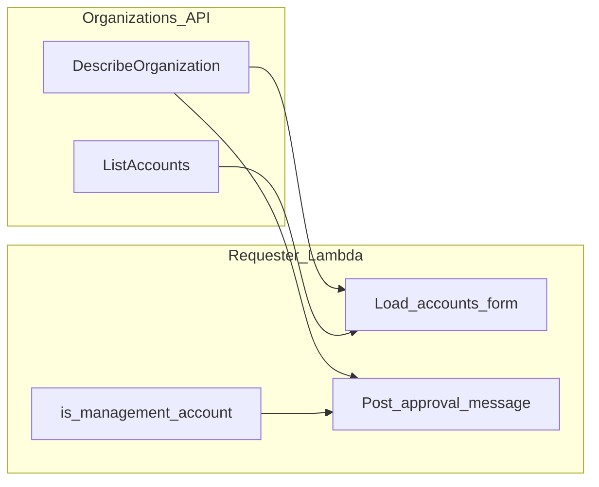

# Design Document: Management account highlighting (Slack + Teams)

## Overview

Extend [`src/organizations.py`](../../src/organizations.py) with read-only helpers that call `describe_organization` and compare account IDs to `MasterAccountId`. The requester surfaces (Slack modal, Teams task module, and channel approval messages) consume an optional `management_account_id: str | None` obtained once per relevant code path via `get_management_account_id(org_client)`.

User-facing strings use **management account**. Code comments may reference the AWS API field `MasterAccountId`.

## Architecture

## API surface (`organizations` module)

| Function | Behavior |
|----------|----------|
| `get_management_account_id(client) -> str \| None` | Calls `describe_organization()`, returns stripped `MasterAccountId` or `None`; on any client error logs with `logger.exception` and returns `None`. |
| `is_management_account(account_id: str, management_account_id: str \| None) -> bool` | `True` only when both strings are non-empty and equal after strip. |

No caching is required for MVP: one `DescribeOrganization` per form load and one per approval post is acceptable. Code paths that only build **group** approval cards do not call `DescribeOrganization` (management context is unused). Optional follow-up: reuse S3-backed cache patterns used for `ListAccounts`.

## Slack

| Location | Change |
|----------|--------|
| [`slack_helpers.RequestForAccessView.build_select_account_input_block`](../../src/requester/slack/slack_helpers.py) | Accept `management_account_id`; append ` (management account)` to option `PlainText` when `is_management_account` holds. Keep `value=account.id` unchanged. |
| [`slack_helpers.RequestForAccessView.update_with_accounts_and_permission_sets`](../../src/requester/slack/slack_helpers.py) | Thread `management_account_id` into the account block builder. |
| [`slack_helpers.build_approval_request_message_blocks`](../../src/requester/slack/slack_helpers.py) | New optional `management_account_id`; for account requests replace combined account line with `Account name:` / `Account ID:` / `Role name:`; if management, append a `SectionBlock` warning immediately before `ActionsBlock`. |
| [`slack_app`](../../src/requester/slack/slack_app.py) | After loading accounts for modal update, call `get_management_account_id`; pass into view update. On access submission, fetch id again (or reuse same call scope) and pass into `build_approval_request_message_blocks`. |

Group approval path in [`group.py`](../../src/group.py) continues to call the builder without management context.

## Teams

| Location | Change |
|----------|--------|
| [`teams_cards.build_account_access_form`](../../src/requester/teams/teams_cards.py) | Optional `management_account_id`; mark matching choice title with ` (management account)`. |
| [`teams_cards.build_approval_card`](../../src/requester/teams/teams_cards.py) | Optional `management_account_id`; split account fact into `Account name` and `Account ID`; rename role fact title to `Role name`; insert warning `Container` (`style: attention`) after `FactSet` when management. |
| [`teams_handlers`](../../src/requester/teams/teams_handlers.py) | `_build_form_card` (account task module) and `_build_card_for_approval_update` (account records only) fetch `get_management_account_id` and pass through. |
| [`teams_approval_deferred.post_account_approval_to_teams_channel`](../../src/requester/teams/teams_approval_deferred.py) | Same for deferred post. |
| [`revoker._build_teams_approval_card_for_expiry`](../../src/revoker.py) | Pass management id when rebuilding account cards (revoker already has `org_client`). |

## IAM

Add `organizations:DescribeOrganization` to the requester Lambda policy in [`slack_handler_lambda.tf`](../../slack_handler_lambda.tf). Add the same action to [`perm_revoker_lambda.tf`](../../perm_revoker_lambda.tf) because [`revoker._build_teams_approval_card_for_expiry`](../../src/revoker.py) calls `get_management_account_id` when rebuilding Teams **account** expiry cards (not used on the group branch).

## Testing

- Unit tests for `get_management_account_id` / `is_management_account` with `MagicMock` Organizations client.
- Teams: extend property or add focused tests for FactSet keys and presence of warning container when `management_account_id` matches `account.id`.
- Optional: Slack block dict assertions in a small new test module if mocking `build_approval_request_message_blocks` dependencies is heavy; prefer testing pure formatting helpers if extracted, or thin integration with mocked clients.
