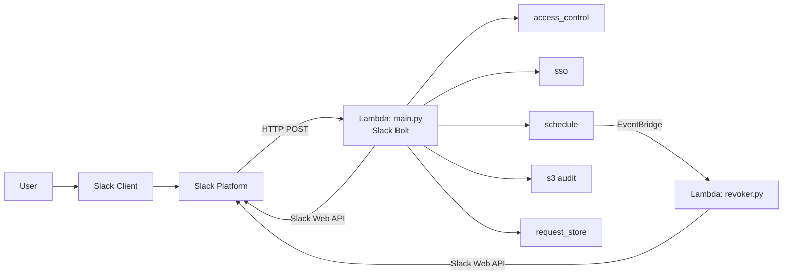
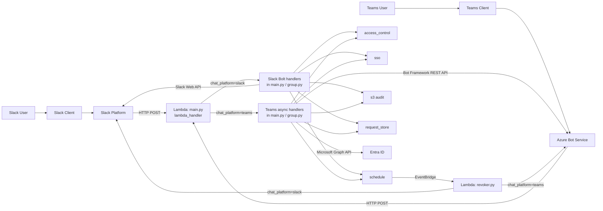
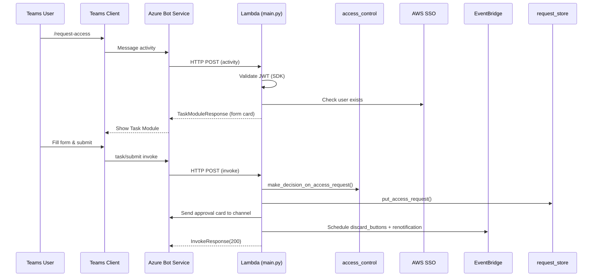
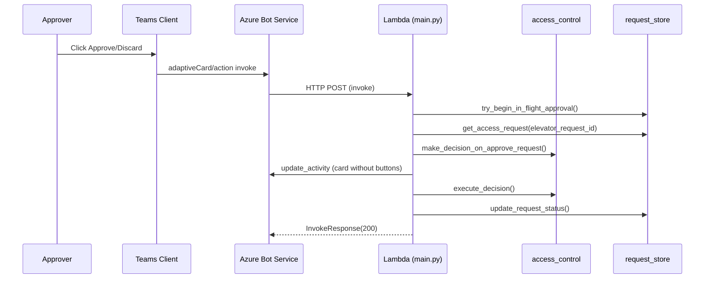

# Design Document: Microsoft Teams Integration for SSO Elevator

## Overview

This design describes how to adapt the existing SSO Elevator Slack integration to work with Microsoft Teams. The core principle is **transport substitution**: business logic (`access_control`, `sso`, `schedule`, `s3`, `request_store`) remains unchanged — only the messaging transport and UI layer changes.

Teams code lives in the same files as Slack code (`main.py`, `group.py`, `revoker.py`), clearly separated by `if cfg.chat_platform == "teams":` branches. There is no separate Teams entry-point file. The existing `ports.py` and `teams_adapter.py` stub are dead code and will be deleted.

### Key Design Decisions

1. **Same files, platform branches**: Teams handlers are added directly to `main.py` and `group.py` alongside the existing Slack handlers. The single `lambda_handler` in `main.py` routes to Slack or Teams code based on `chat_platform`. No new handler file is created.

2. **Shared domain types**: `entities.slack.User` is already used throughout business logic and EventBridge event payloads. We introduce `entities.teams.TeamsUser` with the same fields (`id`, `email`, `real_name`) so it can be passed to business logic without changes. A `to_slack_user()` adapter method bridges the gap for serialization into existing event structures.

3. **Structured button data**: Teams `Action.Submit.data` carries JSON directly — no text parsing needed. This eliminates the fragile `ButtonClickedPayload` text-splitting pattern. The Teams handler reads `elevator_request_id` from `Action.Submit.data` and loads request details from `request_store`.

4. **Proactive messaging via DynamoDB**: Teams requires stored `ConversationReference` objects for proactive DMs. We store these in the existing DynamoDB table (same as `request_store`) with a `CONV_REF` entity type. Teams-specific card state (`teams_conversation_id`, `teams_activity_id`) is stored via a separate `update_teams_presentation` call — the `ElevatorRequestRecord` model itself is not changed.

5. **Revoker platform routing**: The revoker Lambda checks `chat_platform` config and instantiates either a Slack `WebClient` or a Teams `BotFrameworkAdapter` for notifications. EventBridge scheduling logic is unchanged.

## Architecture

### Current Architecture (Slack)



### Target Architecture (Teams added)



### Lambda Deployment Model

One Lambda, one `lambda_handler` entry point in `main.py`. The handler routes internally:

```python
def lambda_handler(event, context):
    if cfg.chat_platform == "teams":
        return asyncio.run(handle_teams_event(event, context))
    slack_handler = SlackRequestHandler(app=app)
    return slack_handler.handle(event, context)
```

Slack handlers are synchronous (Slack Bolt pattern). Teams handlers are `async def` (Bot Framework requirement) and are run via `asyncio.run()` at the Lambda boundary. Both call the same synchronous business logic functions — `access_control`, `sso`, `request_store` etc. — without any changes to those modules.

| Lambda | Slack | Teams |
|--------|-------|-------|
| **Requester handler** | `main.py` Slack Bolt handlers | `main.py` async Teams handlers |
| **Revoker** | `revoker.py` with `slack_sdk.WebClient` | `revoker.py` with `TeamsNotifier` (selected by `chat_platform`) |

## Components and Interfaces

### New Modules

#### `src/teams_cards.py` — Adaptive Card Builders

Pure functions that build Adaptive Card JSON structures. Equivalent of the Block Kit building code in `slack_helpers.py`.

```python
def build_account_access_form(
    accounts: list[entities.aws.Account],
    permission_sets: list[entities.aws.PermissionSet],
    duration_options: list[str],
) -> dict:
    """Build Adaptive Card for account access request Task Module."""

def build_group_access_form(
    groups: list[entities.aws.SSOGroup],
    duration_options: list[str],
) -> dict:
    """Build Adaptive Card for group access request Task Module."""

def build_approval_card(
    requester_name: str,
    account: entities.aws.Account | None,
    group: entities.aws.SSOGroup | None,
    role_name: str | None,
    reason: str,
    permission_duration: str,
    show_buttons: bool,
    color_style: str,
    request_data: dict,
    elevator_request_id: str | None = None,
) -> dict:
    """Build Adaptive Card for approval request message in channel."""

def update_card_after_decision(
    original_card: dict,
    decision_action: str,
    approver_name: str,
    color_style: str,
) -> dict:
    """Remove ActionSet, add decision footer, update color style."""

def update_card_on_expiry(
    original_card: dict,
    expiration_hours: int,
    expired_style: str,
) -> dict:
    """Remove ActionSet, add expiry footer, set expired style."""

def get_color_style(emoji_config: str) -> str:
    """Map emoji config values to Adaptive Card Container styles."""
```

#### `src/teams_users.py` — Teams User Resolution

Handles user identity resolution via Microsoft Graph API and TeamsInfo.

```python
async def get_user_from_activity(turn_context: TurnContext) -> entities.teams.TeamsUser:
    """Extract user info from incoming activity via TeamsInfo."""

async def get_user_by_email(graph_client, email: str) -> entities.teams.TeamsUser:
    """Look up a Teams user by email via Microsoft Graph API. Handles 429 retry."""

async def check_user_in_channel(
    turn_context: TurnContext,
    channel_id: str,
    user_aad_id: str,
) -> bool:
    """Check if user is a member of the approval channel via TeamsInfo."""

def build_mention(user_id: str, display_name: str) -> tuple[str, dict]:
    """Build mention text and Mention entity object for a Teams user."""

async def resolve_principal_to_teams_user(
    graph_client,
    sso_user_id: str,
    sso_client,
    identity_store_client,
    cfg,
) -> entities.teams.TeamsUser | None:
    """Resolve SSO principal ID → email → Teams user for mentions in revoker."""
```

#### `src/entities/teams.py` — Teams User Entity

```python
class TeamsUser(BaseModel):
    """Teams user with fields compatible with entities.slack.User."""
    id: str
    aad_object_id: str
    email: str
    display_name: str

    @property
    def real_name(self) -> str:
        return self.display_name

    def to_slack_user(self) -> entities.slack.User:
        """Convert to slack.User for passing to business logic that expects it."""
        return entities.slack.User(id=self.id, email=self.email, real_name=self.display_name)
```

### Modified Modules

#### `src/main.py` and `src/group.py` — Teams handlers added inline

Teams-specific handler functions are added to `main.py` and `group.py` alongside the existing Slack functions. They are `async def` because Bot Framework SDK is async. The single `lambda_handler` routes between Slack and Teams:

```python
# main.py

# --- existing Slack Bolt app (unchanged) ---
app = App(process_before_response=True)

# --- new Teams bot ---
class SSOElevatorBot(ActivityHandler):
    async def on_message_activity(self, turn_context: TurnContext) -> None:
        """Handle /request-access and /request-group commands."""

    async def on_invoke_activity(self, turn_context: TurnContext) -> InvokeResponse:
        """Handle task/fetch, task/submit, and adaptiveCard/action invokes."""

    async def _handle_task_fetch(self, turn_context: TurnContext) -> TaskModuleResponse: ...
    async def _handle_task_submit(self, turn_context: TurnContext) -> TaskModuleResponse: ...
    async def _handle_card_action(self, turn_context: TurnContext) -> InvokeResponse: ...

async def handle_teams_event(event: dict, context) -> dict:
    """Convert API Gateway event to Bot Framework activity and process it."""

# --- single entry point for both platforms ---
def lambda_handler(event, context):
    if cfg.chat_platform == "teams":
        return asyncio.run(handle_teams_event(event, context))
    slack_handler = SlackRequestHandler(app=app)
    return slack_handler.handle(event, context)
```

Slack handlers remain synchronous and untouched. Teams handlers are `async def` — they are always entered via `asyncio.run()` at the `lambda_handler` boundary, so there is no event loop conflict. Both call the same synchronous business logic (`access_control`, `sso`, `request_store`, `schedule`).

#### `src/config.py` — Platform Configuration

Already has `chat_platform`, `teams_microsoft_app_id`, `teams_microsoft_app_password`, `teams_azure_tenant_id`, `teams_approval_conversation_id` fields. Add validation:

```python
@model_validator(mode="after")
def validate_platform_config(self) -> "Config":
    if self.chat_platform == "teams":
        missing = []
        if not self.teams_microsoft_app_id:
            missing.append("teams_microsoft_app_id")
        if not self.teams_microsoft_app_password:
            missing.append("teams_microsoft_app_password")
        if not self.teams_azure_tenant_id:
            missing.append("teams_azure_tenant_id")
        if not self.teams_approval_conversation_id:
            missing.append("teams_approval_conversation_id")
        if missing:
            raise ValueError(f"Teams platform requires: {', '.join(missing)}")
    return self
```

Note: `teams_azure_tenant_id` is required at runtime (Lambda startup fails fast if missing). Terraform does not enforce this constraint — the variable is optional in Terraform to allow flexible deployment pipelines. This is intentional.

#### `src/revoker.py` — Platform-Aware Notifications

The revoker checks `chat_platform` and uses either Slack `WebClient` or `TeamsNotifier`:

```python
def get_notifier(cfg: config.Config):
    """Return Slack WebClient or TeamsNotifier based on config."""
    if cfg.chat_platform == "teams":
        return TeamsNotifier(cfg)
    return slack_sdk.WebClient(token=cfg.slack_bot_token)
```

For Teams notifications in the revoker, we need a lightweight adapter that can send and update activities using stored credentials (no incoming turn context available):

```python
class TeamsNotifier:
    """Send/update Teams messages from the revoker Lambda (no turn context)."""

    def __init__(self, cfg: config.Config):
        self.app_id = cfg.teams_microsoft_app_id
        self.app_password = cfg.teams_microsoft_app_password
        self.tenant_id = cfg.teams_azure_tenant_id
        self.conversation_id = cfg.teams_approval_conversation_id

    async def send_message(self, text: str, card: dict | None = None) -> str:
        """Send a message to the approval channel. Returns activity_id."""

    async def update_message(self, activity_id: str, card: dict) -> None:
        """Update an existing message (card) by activity_id."""

    async def send_thread_reply(self, parent_activity_id: str, text: str) -> None:
        """Send a reply in a conversation thread."""

    async def send_proactive_dm(self, conversation_reference: dict, text: str) -> None:
        """Send a proactive DM using a stored ConversationReference."""
```

#### `src/request_store.py` — Extended for Teams State

Add storage for Teams-specific state:

```python
def update_teams_presentation(elevator_request_id: str, conversation_id: str, activity_id: str) -> None:
    """Store Teams activity_id and conversation_id for card updates."""

def save_conversation_reference(user_aad_id: str, reference: dict) -> None:
    """Store ConversationReference for proactive messaging."""

def get_conversation_reference(user_aad_id: str) -> dict | None:
    """Retrieve stored ConversationReference."""
```

#### `src/s3.py` — Audit Entry Compatibility

The `AuditEntry` dataclass already has `requester_slack_id`, `approver_slack_id`, `requester_email`, `approver_email` fields. For Teams:
- `requester_slack_id` / `approver_slack_id` will contain the Teams user ID (for backward compatibility with existing log consumers)
- `requester_email` / `approver_email` will contain the email (already platform-independent)
- No schema changes needed — the field names are historical but the values are platform-agnostic

#### `src/events.py` — Event Model Compatibility

`RevokeEvent` and `GroupRevokeEvent` contain `entities.slack.User` for `approver` and `requester`. Since `TeamsUser.to_slack_user()` produces a compatible `entities.slack.User`, the event serialization format stays unchanged. EventBridge payloads remain backward-compatible.

`DiscardButtonsEvent` and `ApproverNotificationEvent` currently carry Slack-specific fields (`channel_id`, `time_stamp` as Slack message_ts). For Teams, add optional fields:

```python
class DiscardButtonsEvent(BaseModel):
    # existing Slack fields stay as-is
    channel_id: str          # Slack channel id (empty string for Teams)
    time_stamp: str          # Slack message_ts (empty string for Teams)
    # new optional Teams fields
    teams_conversation_id: str | None = None
    teams_activity_id: str | None = None
    elevator_request_id: str | None = None

class ApproverNotificationEvent(BaseModel):
    # existing Slack fields stay as-is
    channel_id: str
    time_stamp: str
    # new optional Teams fields
    teams_conversation_id: str | None = None
    teams_activity_id: str | None = None
    ...
```

The revoker reads `chat_platform` from config and uses the appropriate fields. Existing Slack events are unaffected (Teams fields default to `None`).

### Interaction Flows

#### Account Access Request Flow (Teams)



#### Approve/Discard Flow (Teams)



## Data Models

### Adaptive Card Schemas

#### Account Access Request Form

```json
{
  "type": "AdaptiveCard",
  "$schema": "http://adaptivecards.io/schemas/adaptive-card.json",
  "version": "1.5",
  "body": [
    { "type": "TextBlock", "text": "Request AWS Account Access", "size": "large", "weight": "bolder" },
    { "type": "Input.ChoiceSet", "id": "account_id", "label": "Select Account", "style": "filtered", "choices": [] },
    { "type": "Input.ChoiceSet", "id": "permission_set", "label": "Select Permission Set", "style": "filtered", "choices": [] },
    { "type": "Input.ChoiceSet", "id": "duration", "label": "Duration", "choices": [] },
    { "type": "Input.Text", "id": "reason", "label": "Reason", "isMultiline": true, "placeholder": "Reason will be saved in audit logs." }
  ],
  "actions": [{ "type": "Action.Submit", "title": "Request" }]
}
```

#### Approval Request Card

```json
{
  "type": "AdaptiveCard",
  "version": "1.5",
  "body": [
    {
      "type": "Container",
      "style": "warning",
      "items": [{ "type": "TextBlock", "text": "AWS Account Access Request", "size": "large", "weight": "bolder" }]
    },
    {
      "type": "FactSet",
      "facts": [
        { "title": "Requester", "value": "<at>John Doe</at>" },
        { "title": "Account", "value": "production #123456789" },
        { "title": "Role", "value": "AdministratorAccess" },
        { "title": "Reason", "value": "Deploy hotfix" },
        { "title": "Duration", "value": "2h 0m" }
      ]
    }
  ],
  "actions": [
    { "type": "Action.Submit", "title": "Approve", "style": "positive", "data": { "action": "approve", "elevator_request_id": "..." } },
    { "type": "Action.Submit", "title": "Discard", "style": "destructive", "data": { "action": "discard", "elevator_request_id": "..." } }
  ]
}
```

### DynamoDB Extensions

New entity types in the existing `request_store` table:

| Entity Type | Key Pattern | Fields |
|-------------|-------------|--------|
| `CONV_REF` | `convref:{aad_object_id}` | `reference` (JSON string of ConversationReference) |
| `ACCESS_REQUEST` (extended) | `{elevator_request_id}` | + `teams_conversation_id`, `teams_activity_id` |

### Color Style Mapping

| Slack Emoji Config | Adaptive Card Container Style |
|-------------------|-------------------------------|
| `:large_green_circle:` (good_result) | `good` |
| `:large_yellow_circle:` (waiting_result) | `warning` |
| `:red_circle:` (bad_result) | `attention` |
| `:white_circle:` (discarded_result) | `default` |

## Correctness Properties

*A property is a characteristic or behavior that should hold true across all valid executions of a system — essentially, a formal statement about what the system should do. Properties serve as the bridge between human-readable specifications and machine-verifiable correctness guarantees.*

### Property 1: Form card completeness

*For any* non-empty list of accounts and permission sets (or groups), the generated Adaptive Card for the request form SHALL contain an `Input.ChoiceSet` for each data field (account/permission set/group), a duration `Input.ChoiceSet`, and a reason `Input.Text` — with the number of choices in each `Input.ChoiceSet` matching the number of input items.

**Validates: Requirements 2.1, 2.2**

### Property 2: Form submission parsing round-trip

*For any* valid combination of account ID, permission set name, duration string, reason text, and requester ID embedded in a task/submit payload, parsing the payload SHALL produce a request object whose fields exactly match the original input values.

**Validates: Requirements 2.4**

### Property 3: Approval card completeness

*For any* request data (requester name, account or group, role name, reason, duration), the generated approval Adaptive Card SHALL contain a FactSet where every required field appears as a Fact with the correct value.

**Validates: Requirements 3.1, 3.2**

### Property 4: Approval card buttons match approval requirement

*For any* request data, when `show_buttons` is True the approval card SHALL contain an ActionSet with exactly two `Action.Submit` buttons (Approve with style positive, Discard with style destructive) whose `data` contains the `elevator_request_id`; when `show_buttons` is False the card SHALL contain no ActionSet.

**Validates: Requirements 3.3, 3.4**

### Property 5: Card color style application

*For any* valid color style string (`good`, `warning`, `attention`, `default`), building or updating a card with that style SHALL produce a card whose header Container has the `style` property set to that exact value.

**Validates: Requirements 3.5, 4.4**

### Property 6: Mention formatting

*For any* non-empty display name and user ID, building a mention SHALL produce text containing `<at>{display_name}</at>` and a Mention entity object with `mentioned.id` equal to the user ID and `text` matching the at-tag in the activity text.

**Validates: Requirements 3.6, 12.1**

### Property 7: Card state transition preserves content

*For any* approval card containing an ActionSet and a FactSet, applying a decision update (approve or discard) or expiry update SHALL produce a card where: (a) the FactSet is unchanged, (b) no ActionSet is present, and (c) a new TextBlock with the decision/expiry information is appended.

**Validates: Requirements 4.3, 10.2**

### Property 8: Teams user to Slack user compatibility

*For any* valid TeamsUser (non-empty id, email, display_name), calling `to_slack_user()` SHALL produce an `entities.slack.User` where `id` equals the TeamsUser `id`, `email` equals the TeamsUser `email`, and `real_name` equals the TeamsUser `display_name`.

**Validates: Requirements 5.4**

### Property 9: Audit log completeness

*For any* request processed via Teams with non-empty requester and approver data, the resulting `AuditEntry` SHALL have non-empty `requester_email`, `approver_email`, and non-"NA" `requester_slack_id` and `approver_slack_id` fields (containing the Teams user IDs).

**Validates: Requirements 13.1, 13.2**

## Error Handling

### Microsoft Graph API Errors

| Error | Handling |
|-------|----------|
| **429 Too Many Requests** | Retry after `Retry-After` header value. Max 3 retries with exponential backoff. Log each retry. |
| **403 Forbidden** (proactive DM blocked) | Log with `logger.exception()`, continue main flow. User won't receive DM but approval flow proceeds. |
| **404 User Not Found** | Log warning, return `None`. Caller handles missing user (e.g., skip mention, use email as fallback). |

### Bot Framework Errors

| Error | Handling |
|-------|----------|
| **JWT validation failure** | SDK returns 401 automatically. No custom handling needed. |
| **update_activity failure** | Log with `logger.exception()`, continue operation. Card may show stale state but request processing completes. |
| **Timeout (>5s for SSO operations)** | Return immediate `InvokeResponse(200)` with "Processing..." status. Complete work asynchronously, then call `update_activity` with final result. |

### Proactive Messaging Errors

| Error | Handling |
|-------|----------|
| **No stored ConversationReference** | Log info, skip DM. User must interact with bot first. |
| **403 Forbidden (org policy blocks bot DMs)** | Log with `logger.exception()`, continue. Same as Slack behavior when DM fails. |

### General Error Pattern

All Teams handler functions use the same error handling pattern as the existing `@handle_errors` decorator in Slack, adapted for async:

```python
async def handle_errors_teams(turn_context: TurnContext, func, cfg):
    try:
        return await func()
    except SSOUserNotFound:
        await turn_context.send_activity(
            f"<at>{user_name}</at> Your request failed because SSO Elevator could not find your user in AWS SSO."
        )
    except Exception as e:
        logger.exception(f"Error in Teams handler: {e}")
        await turn_context.send_activity("An unexpected error occurred. Check the logs for details.")
```

## Testing Strategy

### Property-Based Tests (Hypothesis)

The project already uses Hypothesis (see `src/tests/strategies.py`). Property tests for the Teams integration focus on the **pure card-building and data-transformation functions** in `teams_cards.py`, `teams_users.py`, and `entities/teams.py`.

**Configuration**: Minimum 100 iterations per property test.

**Tag format**: `Feature: teams-messaging-integration, Property {N}: {title}`

Each correctness property from the design maps to a single Hypothesis test:

| Property | Module Under Test | What Varies |
|----------|-------------------|-------------|
| 1: Form card completeness | `teams_cards.build_account_access_form`, `build_group_access_form` | Account/group lists, permission sets |
| 2: Form submission parsing round-trip | `main._parse_task_submit` (Teams section of main.py) | Account IDs, permission set names, durations, reasons |
| 3: Approval card completeness | `teams_cards.build_approval_card` | Requester names, accounts, groups, roles, reasons, durations |
| 4: Buttons match approval requirement | `teams_cards.build_approval_card` | `show_buttons` flag, request data |
| 5: Card color style application | `teams_cards.build_approval_card`, `update_card_after_decision` | Color style values |
| 6: Mention formatting | `teams_users.build_mention` | Display names, user IDs |
| 7: Card state transition | `teams_cards.update_card_after_decision`, `update_card_on_expiry` | Card content, decision types |
| 8: TeamsUser compatibility | `entities.teams.TeamsUser.to_slack_user` | User data (id, email, display_name) |
| 9: Audit log completeness | `s3.AuditEntry` construction | Teams user data |

### Unit Tests (pytest)

Example-based tests for specific scenarios and edge cases:

- **Command routing**: `/request-access` opens account form, `/request-group` opens group form
- **Missing config**: Empty statements → error message to channel
- **SSO user not found**: `SSOUserNotFound` → error message with user mention
- **Unauthorized approver**: `decision.permit=False` → thread reply with denial
- **In-flight approval**: Second click → "already in progress" message
- **Graph API 429 retry**: Mock 429 response → verify retry with backoff
- **Proactive DM 403**: Mock forbidden → verify error logged, flow continues
- **Channel membership failure**: Mock error → treat as non-member, send DM
- **Config validation**: `chat_platform=teams` without required params → validation error

### Integration Tests

- **Lambda handler end-to-end**: Mock API Gateway event → `lambda_handler` → verify response structure
- **Revoker platform routing**: `chat_platform=teams` → verify Bot Framework adapter used instead of Slack WebClient
- **EventBridge event compatibility**: Verify events with `TeamsUser.to_slack_user()` serialize/deserialize correctly

### Mocking Strategy (per workspace rules)

All external dependencies are mocked:
- **AWS services**: boto3 clients (SSO, Organizations, S3, EventBridge, DynamoDB)
- **Bot Framework SDK**: `TurnContext`, `TeamsInfo`, `BotFrameworkAdapter`
- **Microsoft Graph API**: Graph client responses
- **Slack SDK**: Not needed for Teams tests (separate handler)

### Dependencies

New Python packages required (minimum versions; exact versions are pinned when added to `src/requirements.txt`):

```
botbuilder-core>=4.14.0        # Bot Framework core SDK
botbuilder-schema>=4.14.0      # Activity/Entity types
botbuilder-integration-aiohttp>=4.14.0  # HTTP adapter
msgraph-sdk>=1.0.0             # Microsoft Graph client
azure-identity>=1.15.0         # Authentication (for Graph API)
```
