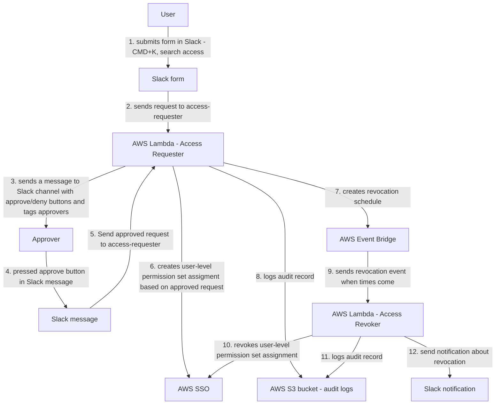

[](https://fivexl.io/)

# Terraform module to allow temporary assignment of AWS IAM Identity Center (Successor to AWS Single Sign-On) Permission sets to a user via Slack form

- [Introduction](#introduction)
- [Functionality](#functionality)
- [Important Considerations and Assumptions](#important-considerations-and-assumptions)
- [Deployment and Usage](#deployment-and-usage)
  * [Note on dependencies](#note-on-dependencies)
  * [Module configuration options and automatic approval](#module-configuration-options-and-automatic-approval)
    + [Configuration structure](#configuration-structure)
    + [Automatic Approval](#automatic-approval)
    + [Aggregation of Rules](#aggregation-of-rules)
    + [Single Approver](#single-approver)
  * [Terraform deployment example](#terraform-deployment-example)
  * [Slack App creation](#slack-app-creation)
- [Terraform docs](#terraform-docs)
  * [Requirements](#requirements)
  * [Providers](#providers)
  * [Modules](#modules)
  * [Resources](#resources)
  * [Inputs](#inputs)
  * [Outputs](#outputs)
  * [More info](#more-info)
- [Development](#development)
  * [Post review](#post-review)


# Introduction
Currently, AWS IAM Identity Center does not support the temporary assignment of permission sets to users. As a result, teams using AWS IAM Identity Center are forced to either create highly restricted permission sets or rely on AWS IAM role chaining. Both approaches have significant drawbacks and result in an overly complex security model. The desired solution is one where AWS operators are granted access only when necessary and for the exact duration needed, with a default state of no access or read-only access.

The terraform-aws-sso-elevator module addresses this issue by allowing the implementation of temporary elevated access to AWS accounts while avoiding permanently assigned permission sets, thereby achieving the principle of least privilege access.

For more information on temporary elevated access for AWS and the AWS-provided solution, visit [Managing temporary elevated access to your AWS environment](https://aws.amazon.com/blogs/security/managing-temporary-elevated-access-to-your-aws-environment/).

The key difference between the terraform-aws-sso-elevator module and the option described in the blog post above is that the module enables requesting access elevation via a Slack form. We hope that this implementation may inspire AWS to incorporate native support for temporary access elevation in AWS IAM Identity Center.

# Functionality



The module deploys two AWS Lambda functions: access-requester and access-revoker. The access-requester handles requests from Slack, creating user-level permission set assignments and an Amazon EventBridge trigger that activates the access-revoker Lambda when it is time to revoke access. The access-revoker revokes user access when triggered by EventBridge and also runs daily to revoke any user-level permission set assignments without an associated EventBridge trigger. Group-level permission sets are not affected.

For auditing purposes, information about all access grants and revocations is stored in S3. See [documentation here](athena_query/) to find out how to configure AWS Athena to query audit logs.

Additionally, the Access-Revoker continuously reconciles the revocation schedule with all user-level permission set assignments and issues warnings if it detects assignments without a revocation schedule (presumably created by someone manually). By default, the Access-Revoker will automatically revoke all unknown user-level permission set assignments daily. However, you can configure it to operate more or less frequently.

# Important Considerations and Assumptions

SSO elevator assumes that your Slack user email will match SSO user id otherwise it won't be able to match Slack user sendign request to an AWS SSO user.

When onboarding your organization, be aware that the access-revoker will revoke all user-level Permission Set assignments in the AWS accounts you specified in the module configuration. If you specify Accounts: '*' in any of rules, it will remove user-level assignments from all accounts. Therefore, if you want to maintain some permanent SSO assignments (e.g., read-only in production and admin in development or test accounts), you should use group-level assignments. It is advisable to ensure your AWS admin has the necessary access level to your AWS SSO management account through group-level assignments so that you can experiment with the module's configuration.

# Deployment and Usage

## Note on dependencies

Lambdas are built using Python 3.10 and rely on Poetry for package management and dependency resolution. To run Terraform, both Python 3.10 and Poetry need to be installed on your system. If these tools are not available, you can opt to package the Lambdas using Docker by providing the appropriate flag to the module. We do recommend using Docker build where possible to avoid misconfigurations or missing packages.

The deployment process is divided into two main parts: deploying the Terraform module, which sets up the necessary infrastructure and resources for the Lambdas to function, and creating a Slack App, which will be the interface through which users can interact with the Lambdas. Detailed instructions on how to perform both of these steps, along with the Slack App manifest, can be found below.

## Module configuration options and automatic approval

### Configuration structure

The configuration is a list of dictionaries, where each dictionary represents a single configuration rule.

Each configuration rule specifies which resource(s) the rule applies to, which permission set(s) are being requested, who the approvers are, and any additional options for approving the request.

The fields in the configuration dictionary are:

- `ResourceType`: The type of resource being requested, e.g. "Account". Currently only "Account" is supported.
- `Resource`: The resource(s) being requested. This can be a string or a list of strings. If set to "*", the rule matches all resources of the specified ResourceType.
- `PermissionSet`: The permission set(s) being requested. This can be a string or a list of strings. If set to "*", the rule matches all permission sets for the specified Resource and ResourceType.
- `Approvers`: The list of approvers for the request. This can be a string or a list of strings.
- `AllowSelfApproval`: A boolean indicating whether the requester can approve their own request if they are in the Approvers list. Defaults to false.
- `ApprovalIsNotRequired`: A boolean indicating whether the request can be approved automatically without any approvers. Defaults to false.

### Automatic Approval
Requests will be approved automatically if either of the following conditions are met:

- AllowSelfApproval is set to true and the requester is in the Approvers list.
- ApprovalIsNotRequired is set to true.

### Aggregation of Rules
The approval decision and final list of reviewers will be calculated dynamically based on the aggregate of all rules. If you have a rule that specifies that someone is an approver for all accounts, then that person will be automatically added to all requests, even if there are more detailed rules for specific accounts or permission sets.

### Single Approver
If there is only one approver and AllowSelfApproval is not set to true, nobody will be able to approve the request.

## Terraform deployment example

```terraform

data "aws_ssoadmin_instances" "this" {}

# You will have to create /sso-elevator/slack-signing-secret AWS SSM Parameter
# and store Slack app signing secret there, if you have not created app yet then
# you can leave a dummy value there and update it after Slack app is ready
data "aws_ssm_parameter" "sso_elevator_slack_signing_secret" {
  name = "/sso-elevator/slack-signing-secret"
}

# You will have to create /sso-elevator/slack-bot-token AWS SSM Parameter
# and store Slack bot token there, if you have not created app yet then
# you can leave a dummy value there and update it after Slack app is ready
data "aws_ssm_parameter" "sso_elevator_slack_bot_token" {
  name = "/sso-elevator/slack-bot-token"
}

module "aws_sso_elevator" {
  source                           = "github.com/fivexl/terraform-aws-sso-elevator.git"
  aws_sns_topic_subscription_email = "email@gmail.com"

  slack_signing_secret = data.aws_ssm_parameter.sso_elevator_slack_signing_secret.value
  slack_bot_token      = data.aws_ssm_parameter.sso_elevator_slack_bot_token.value
  slack_channel_id     = "***********"
  schedule_expression  = "cron(0 23 * * ? *)" # revoke access schedule expression
  schedule_expression_for_check_on_inconsistency = "rate(1 hour)" 
  build_in_docker = true
  revoker_post_update_to_slack = true
  # If you want to use your own S3 bucket for audit_entry logs
  # then you can specify it name there:
  name_of_existing_s3_bucket = "your-s3-bucket-name"
  # If you dont pass name_of_existing_s3_bucket then module will create new bucket
  s3_bucket_for_audit_entry_name   = "sso-elevator-logs"
  s3_bucket_prefix_for_partitions  = "logs"

  sso_instance_arn = one(data.aws_ssoadmin_instances.this.arns)

  config = [
    # This could be a config for dev/stage account where developers can self-serve
    # permissions
    # Allows Bob and Alice to approve requests for all
    # PermissionSets in accounts dev_account_id and stage_account_id as
    # well as approve its own requests
    # You have to specify at AllowSelfApproval: true or specify two approvers
    # so you do not lock out approver
    {
      "ResourceType" : "Account",
      "Resource" : ["dev_account_id", "stage_account_id"],
      "PermissionSet" : "*",
      "Approvers" : ["bob@corp.com", "alice@corp.com"],
      "AllowSelfApproval" : true,
    },
    # This could be an option for a financial person
    # allows self approval for Billing PermissionSet
    # for account_id for user finances@corp.com
    {
      "ResourceType" : "Account",
      "Resource" : "account_id",
      "PermissionSet" : "Billing",
      "Approvers" : "finances@corp.com",
      "AllowSelfApproval" : true,
    },
    # Your typical CTO - can approve all accounts and all permissions
    # as well as his/hers own requests to avoid lock out
    # Careful withi Resource * since it will cause revocation of all
    # non-module-created user-level permission set assignments in all
    # accounts, add this one later when you are done with single account
    # testing
    {
      "ResourceType" : "Account",
      "Resource" : "*",
      "PermissionSet" : "*",
      "Approvers" : "cto@corp.com",
      "AllowSelfApproval" : true,
    },
    # Read only config for production accounts so developers
    # can check prod when needed
    {
      "ResourceType" : "Account",
      "Resource" : ["prod_account_id", "prod_account_id2"],
      "PermissionSet" : "ReadOnly",
      "AllowSelfApproval" : true,
    },
    # Prod access
    {
      "ResourceType" : "Account",
      "Resource" : ["prod_account_id", "prod_account_id2"],
      "PermissionSet" : "AdministratorAccess",
      "Approvers" : ["manager@corp.com", "ciso@corp.com"],
      "ApprovalIsNotRequired" : false,
      "AllowSelfApproval" : false,
    },
    # example of list being used for permissions sets
    {
      "ResourceType" : "Account",
      "Resource" : "account_id",
      "PermissionSet" : ["ReadOnlyPlus", "AdministratorAccess"],
      "Approvers" : ["ciso@corp.com"], 
      "AllowSelfApproval" : true,
    },

  ]
}

output "aws_sso_elevator_lambda_function_url" {
  value = module.aws_sso_elevator.lambda_function_url
}
```

## Slack App creation
1. Go to https://api.slack.com/
2. Click `create an app`
3. Click `From an app manifest`
4. Select workspace, click `next`
5. Choose `yaml` for app manifest format
6. Update lambda url (from output `aws_sso_elevator_lambda_function_url`) to `request_url` field and paste the following into the text box: 
```yaml
display_information:
  name: WS SSO Access Elevator
  description: AWS SSO access elevator
features:
  bot_user:
    display_name: AWS SSO Access Elevator
    always_online: false
  shortcuts:
    - name: access
      type: global
      callback_id: request_for_access
      description: Request access to Permission Set in AWS Account
oauth_config:
  scopes:
    bot:
      - commands
      - chat:write
      - users:read.email
      - users:read
settings:
  interactivity:
    is_enabled: true
    request_url: <LAMBDA URL GOES HERE - CHECK LAMBDA CONFIGURATION IN AWS CONSOLE OR GET IT FORM TERRAFORM OUTPUT> 
  org_deploy_enabled: false
  socket_mode_enabled: false
  token_rotation_enabled: false
```
7. Check permissions and click `create`
8. Click `install to workspace`
9. Copy `Signing Secret` # for `slack_signing_secret` module input
10. Copy `Bot User OAuth Token` # for `slack_bot_token` module input

# Terraform docs

<!-- BEGINNING OF PRE-COMMIT-TERRAFORM DOCS HOOK -->
## Requirements

| Name | Version |
|------|---------|
| <a name="requirement_terraform"></a> [terraform](#requirement\_terraform) | ~> 1.0 |
| <a name="requirement_aws"></a> [aws](#requirement\_aws) | >= 4.64 |
| <a name="requirement_external"></a> [external](#requirement\_external) | >= 1.0 |
| <a name="requirement_local"></a> [local](#requirement\_local) | >= 1.0 |
| <a name="requirement_null"></a> [null](#requirement\_null) | >= 2.0 |

## Providers

| Name | Version |
|------|---------|
| <a name="provider_aws"></a> [aws](#provider\_aws) | 4.66.1 |

## Modules

| Name | Source | Version |
|------|--------|---------|
| <a name="module_access_requester_slack_handler"></a> [access\_requester\_slack\_handler](#module\_access\_requester\_slack\_handler) | terraform-aws-modules/lambda/aws | 4.16.0 |
| <a name="module_access_revoker"></a> [access\_revoker](#module\_access\_revoker) | terraform-aws-modules/lambda/aws | 4.16.0 |
| <a name="module_sso_elevator_bucket"></a> [sso\_elevator\_bucket](#module\_sso\_elevator\_bucket) | terraform-aws-modules/s3-bucket/aws | 3.6.0 |
| <a name="module_sso_elevator_dependencies"></a> [sso\_elevator\_dependencies](#module\_sso\_elevator\_dependencies) | terraform-aws-modules/lambda/aws | 4.16.0 |

## Resources

| Name | Type |
|------|------|
| [aws_cloudwatch_event_rule.sso_elevator_check_on_inconsistency](https://registry.terraform.io/providers/hashicorp/aws/latest/docs/resources/cloudwatch_event_rule) | resource |
| [aws_cloudwatch_event_rule.sso_elevator_scheduled_revocation](https://registry.terraform.io/providers/hashicorp/aws/latest/docs/resources/cloudwatch_event_rule) | resource |
| [aws_cloudwatch_event_target.check_inconsistency](https://registry.terraform.io/providers/hashicorp/aws/latest/docs/resources/cloudwatch_event_target) | resource |
| [aws_cloudwatch_event_target.sso_elevator_scheduled_revocation](https://registry.terraform.io/providers/hashicorp/aws/latest/docs/resources/cloudwatch_event_target) | resource |
| [aws_iam_role.eventbridge_role](https://registry.terraform.io/providers/hashicorp/aws/latest/docs/resources/iam_role) | resource |
| [aws_iam_role_policy.eventbridge_policy](https://registry.terraform.io/providers/hashicorp/aws/latest/docs/resources/iam_role_policy) | resource |
| [aws_lambda_permission.eventbridge](https://registry.terraform.io/providers/hashicorp/aws/latest/docs/resources/lambda_permission) | resource |
| [aws_scheduler_schedule_group.one_time_schedule_group](https://registry.terraform.io/providers/hashicorp/aws/latest/docs/resources/scheduler_schedule_group) | resource |
| [aws_sns_topic.dlq](https://registry.terraform.io/providers/hashicorp/aws/latest/docs/resources/sns_topic) | resource |
| [aws_sns_topic_subscription.dlq](https://registry.terraform.io/providers/hashicorp/aws/latest/docs/resources/sns_topic_subscription) | resource |
| [aws_caller_identity.current](https://registry.terraform.io/providers/hashicorp/aws/latest/docs/data-sources/caller_identity) | data source |
| [aws_iam_policy_document.revoker](https://registry.terraform.io/providers/hashicorp/aws/latest/docs/data-sources/iam_policy_document) | data source |
| [aws_iam_policy_document.slack_handler](https://registry.terraform.io/providers/hashicorp/aws/latest/docs/data-sources/iam_policy_document) | data source |
| [aws_region.current](https://registry.terraform.io/providers/hashicorp/aws/latest/docs/data-sources/region) | data source |
| [aws_ssoadmin_instances.all](https://registry.terraform.io/providers/hashicorp/aws/latest/docs/data-sources/ssoadmin_instances) | data source |

## Inputs

| Name | Description | Type | Default | Required |
|------|-------------|------|---------|:--------:|
| <a name="input_aws_sns_topic_subscription_email"></a> [aws\_sns\_topic\_subscription\_email](#input\_aws\_sns\_topic\_subscription\_email) | value for the email address to subscribe to the SNS topic | `string` | n/a | yes |
| <a name="input_build_in_docker"></a> [build\_in\_docker](#input\_build\_in\_docker) | Whether to build the lambda in a docker container or using local python (poetry) | `bool` | `true` | no |
| <a name="input_config"></a> [config](#input\_config) | value for the SSO Elevator config | `any` | n/a | yes |
| <a name="input_log_level"></a> [log\_level](#input\_log\_level) | value for the log level | `string` | `"INFO"` | no |
| <a name="input_name_of_existing_s3_bucket"></a> [name\_of\_existing\_s3\_bucket](#input\_name\_of\_existing\_s3\_bucket) | Pass it if you want to use an existing bucket | `string` | `""` | no |
| <a name="input_requester_lambda_name"></a> [requester\_lambda\_name](#input\_requester\_lambda\_name) | value for the requester lambda name | `string` | `"access-requester"` | no |
| <a name="input_requester_lambda_name_postfix"></a> [requester\_lambda\_name\_postfix](#input\_requester\_lambda\_name\_postfix) | For dev purposes | `string` | `""` | no |
| <a name="input_revoker_lambda_name"></a> [revoker\_lambda\_name](#input\_revoker\_lambda\_name) | value for the revoker lambda name | `string` | `"access-revoker"` | no |
| <a name="input_revoker_lambda_name_postfix"></a> [revoker\_lambda\_name\_postfix](#input\_revoker\_lambda\_name\_postfix) | For dev purposes | `string` | `""` | no |
| <a name="input_revoker_post_update_to_slack"></a> [revoker\_post\_update\_to\_slack](#input\_revoker\_post\_update\_to\_slack) | Should revoker send a confirmation of the revocation to Slack? | `bool` | `true` | no |
| <a name="input_s3_bucket_for_audit_entry_name"></a> [s3\_bucket\_for\_audit\_entry\_name](#input\_s3\_bucket\_for\_audit\_entry\_name) | Name of the S3 bucket | `string` | `"sso-elevator-logs"` | no |
| <a name="input_s3_bucket_name_postfix"></a> [s3\_bucket\_name\_postfix](#input\_s3\_bucket\_name\_postfix) | For dev purposes | `string` | `""` | no |
| <a name="input_s3_bucket_prefix_for_partitions"></a> [s3\_bucket\_prefix\_for\_partitions](#input\_s3\_bucket\_prefix\_for\_partitions) | The prefix for the S3 bucket partitions | `string` | `"logs"` | no |
| <a name="input_schedule_expression"></a> [schedule\_expression](#input\_schedule\_expression) | recovation schedule expression (will revoke all user-level assignments unknown to the Elevator) | `string` | `"cron(0 23 * * ? *)"` | no |
| <a name="input_schedule_expression_for_check_on_inconsistency"></a> [schedule\_expression\_for\_check\_on\_inconsistency](#input\_schedule\_expression\_for\_check\_on\_inconsistency) | how often revoker should check for inconsistency (warn if found unknown user-level assignments) | `string` | `"rate(2 hours)"` | no |
| <a name="input_schedule_group_name_postfix"></a> [schedule\_group\_name\_postfix](#input\_schedule\_group\_name\_postfix) | For dev purposes | `string` | `""` | no |
| <a name="input_schedule_role_name_postfix"></a> [schedule\_role\_name\_postfix](#input\_schedule\_role\_name\_postfix) | For dev purposes | `string` | `""` | no |
| <a name="input_slack_bot_token"></a> [slack\_bot\_token](#input\_slack\_bot\_token) | value for the Slack bot token | `string` | n/a | yes |
| <a name="input_slack_channel_id"></a> [slack\_channel\_id](#input\_slack\_channel\_id) | value for the Slack channel ID | `string` | n/a | yes |
| <a name="input_slack_signing_secret"></a> [slack\_signing\_secret](#input\_slack\_signing\_secret) | value for the Slack signing secret | `string` | n/a | yes |
| <a name="input_sso_instance_arn"></a> [sso\_instance\_arn](#input\_sso\_instance\_arn) | value for the SSO instance ARN | `string` | `""` | no |
| <a name="input_tags"></a> [tags](#input\_tags) | A map of tags to assign to resources. | `map(string)` | `{}` | no |

## Outputs

| Name | Description |
|------|-------------|
| <a name="output_lambda_function_url"></a> [lambda\_function\_url](#output\_lambda\_function\_url) | value for the access\_requester lambda function URL |
<!-- END OF PRE-COMMIT-TERRAFORM DOCS HOOK -->

## More info
- [Permission Set](https://docs.aws.amazon.com/singlesignon/latest/userguide/permissionsetsconcept.html)
- [User and groups](https://docs.aws.amazon.com/singlesignon/latest/userguide/users-groups-provisioning.html)

# Development

## Post review

- Post review [url](https://github.com/fivexl/terraform-aws-sso-elevator/compare/review...main)
- ToC generated with [this](https://ecotrust-canada.github.io/markdown-toc/)
