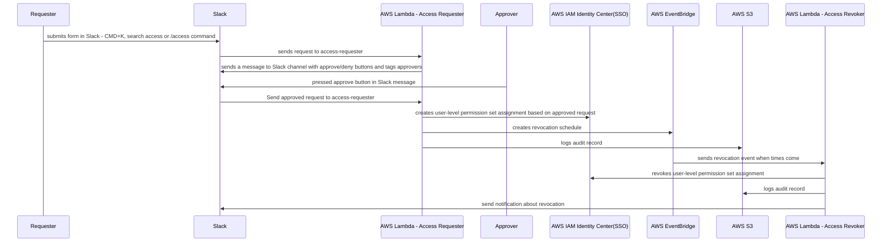
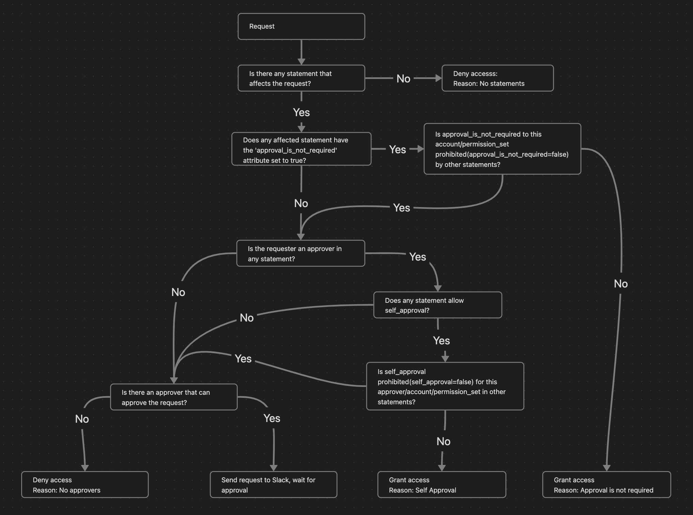

[](https://fivexl.io/)

# Terraform module for implementing temporary elevated access via AWS IAM Identity Center (Successor to AWS Single Sign-On) and Slack

- [Terraform module for implementing temporary elevated access via AWS IAM Identity Center (Successor to AWS Single Sign-On) and Slack](#terraform-module-for-implementing-temporary-elevated-access-via-aws-iam-identity-center-successor-to-aws-single-sign-on-and-slack)
- [Introduction](#introduction)
- [Functionality](#functionality)
  - [Group Assignments Mode](#group-assignments-mode)
- [Important Considerations and Assumptions](#important-considerations-and-assumptions)
- [Deployment and Usage](#deployment-and-usage)
  - [Note on dependencies](#note-on-dependencies)
  - [Updated Build Process](#updated-build-process)
  - [API](#api)
  - [Module configuration options and automatic approval](#module-configuration-options-and-automatic-approval)
    - [Configuration structure](#configuration-structure)
    - [Explicit Deny](#explicit-deny)
    - [Automatic Approval](#automatic-approval)
    - [Aggregation of Rules](#aggregation-of-rules)
    - [Single Approver](#single-approver)
    - [Diagram of processing a request:](#diagram-of-processing-a-request)
  - [Secondary Subdomain Fallback Feature:](#secondary-subdomain-fallback-feature)
  - [Terraform deployment example](#terraform-deployment-example)
  - [Slack App creation](#slack-app-creation)
- [Terraform docs](#terraform-docs)
  - [Requirements](#requirements)
  - [Providers](#providers)
  - [Modules](#modules)
  - [Resources](#resources)
  - [Inputs](#inputs)
  - [Outputs](#outputs)
  - [More info](#more-info)
- [Development](#development)
  - [Post review](#post-review)


# Introduction
Currently, AWS IAM Identity Center does not support the temporary assignment of permission sets to users. As a result, teams using AWS IAM Identity Center are forced to either create highly restricted permission sets or rely on AWS IAM role chaining. Both approaches have significant drawbacks and result in an overly complex security model. The desired solution is one where AWS operators are granted access only when necessary and for the exact duration needed, with a default state of no access or read-only access.

The terraform-aws-sso-elevator module addresses this issue by allowing the implementation of temporary elevated access to AWS accounts while avoiding permanently assigned permission sets, thereby achieving the principle of least privilege access.

For more information on temporary elevated access for AWS and the AWS-provided solution, visit [Managing temporary elevated access to your AWS environment](https://aws.amazon.com/blogs/security/managing-temporary-elevated-access-to-your-aws-environment/).

The key difference between the terraform-aws-sso-elevator module and the option described in the blog post above is that the module enables requesting access elevation via a Slack form. We hope that this implementation may inspire AWS to incorporate native support for temporary access elevation in AWS IAM Identity Center.

AWS announced that [Customers of AWS IAM Identity Center (successor to AWS Single Sign-On) can use CyberArk Secure Cloud Access, Ermetic, and Okta Access Requests for temporary elevated access](https://aws.amazon.com/about-aws/whats-new/2023/05/aws-partners-temporary-elevated-access-capabilities-iam-identity-center/). So if you are already using one of those vendors we recommend checking their offering first.

Watch demo
[](https://youtu.be/iR3Rdjd7QMU)

# Functionality



The module deploys two AWS Lambda functions: access-requester and access-revoker. The access-requester handles requests from Slack, creating user-level permission set assignments and an Amazon EventBridge trigger that activates the access-revoker Lambda when it is time to revoke access. The access-revoker revokes user access when triggered by EventBridge and also runs daily to revoke any user-level permission set assignments without an associated EventBridge trigger. Group-level permission sets are not affected.

For auditing purposes, information about all access grants and revocations is stored in S3. See [documentation here](athena_query/) to find out how to configure AWS Athena to query audit logs.

Additionally, the Access-Revoker continuously reconciles the revocation schedule with all user-level permission set assignments and issues warnings if it detects assignments without a revocation schedule (presumably created by someone manually). By default, the Access-Revoker will automatically revoke all unknown user-level permission set assignments daily. However, you can configure it to operate more or less frequently.

## Group Assignments Mode
Starting from version 2.0, Terraform AWS SSO Elevator introduces support for group access. SSO elevator now can add users to a groups, to do so, you will need to use /group-access command, which, instead of showing the form for account assignments, will present a Slack form where the user can select a group they want access to, specify a reason, and define the duration for which access is required.

The basic logic for access, configuration, and Slack integration remains the same as before. To enable the new Group Assignments Mode, you need to provide the module with a new group_config Terraform variable:
```hcl
group_config = [
    {              
      "Resource" : ["99999999-8888-7777-6666-555555555555"], #ManagementAccountAdmins
      "Approvers" : [
        "email@gmail.com"
      ]
      "ApprovalIsNotRequired": true
    },
    {              
      "Resource" : ["11111111-2222-3333-4444-555555555555"], #prod read only
      "Approvers" : [
        "email@gmail.com"
      ]
      "AllowSelfApproval" : true,
    },
    {
      "Resource" : ["44445555-3333-2222-1111-555557777777"], #ProdAdminAccess
      "Approvers" : [
        "email@gmail.com"
      ]
    },
]
```
There are two key differences compared to the standard Elevator configuration:
- ResourceType is not required for group access configurations.
- In the Resource field, you must provide group IDs instead of account IDs.

The Elevator will only work with groups specified in the configuration.

If you were using Terraform AWS SSO Elevator before version 2.0.0, you need to update your Slack app manifest by adding a new shortcut to enable this functionality:
{
    "name": "group-access",
    "type": "global",
    "callback_id": "request_for_group_membership",
    "description": "Request access to SSO Group"
}
To disable this functionality, simply remove the shortcut from the manifest.


# Important Considerations and Assumptions

SSO elevator assumes that your Slack user email will match SSO user id otherwise it won't be able to match Slack user sending request to an AWS SSO user.

When onboarding your organization, be aware that the access-revoker will revoke all user-level Permission Set assignments in the AWS accounts you specified in the module configuration. If you specify Accounts: '*' in any of rules, it will remove user-level assignments from all accounts. Therefore, if you want to maintain some permanent SSO assignments (e.g., read-only in production and admin in development or test accounts), you should use group-level assignments. It is advisable to ensure your AWS admin has the necessary access level to your AWS SSO management account through group-level assignments so that you can experiment with the module's configuration.

# Deployment and Usage

## Note on dependencies

Lambdas are built using Python 3.10 and rely on Poetry for package management and dependency resolution. To run Terraform, both Python 3.10 and Poetry need to be installed on your system. If these tools are not available, you can opt to package the Lambdas using Docker by providing the appropriate flag to the module. We do recommend using Docker build where possible to avoid misconfigurations or missing packages.

The deployment process is divided into two main parts: deploying the Terraform module, which sets up the necessary infrastructure and resources for the Lambdas to function, and creating a Slack App, which will be the interface through which users can interact with the Lambdas. Detailed instructions on how to perform both of these steps, along with the Slack App manifest, can be found below.

## Updated Build Process
In 1.4.0 release, the ability to build zip files locally without Docker has been removed due to issues with Python environments and version mismatches. Now, GitHub CI will pre-build the requester and revoker lambda Docker images and push them to FivexL's private ECR. Users can use these pre-built Docker images to build lambdas. 

ECR is private for the following reasons:

- AWS Lambda can't use any other source of images except ECR.
- AWS Lambda can't use public ECR.
- AWS Lambda doesn't support pulling container images from Amazon ECR using a pull-through cache rule (so we can't create a private repo from the user's side to pull images from the GHCR, for example).

Images and repositories are replicated in every region that AWS SSO supports except these:
```
- ap_east_1
- eu_south_1
- ap_southeast_3
- af_south_1
- me_south_1
- il_central_1
- me_central_1
- eu_south_2
- ap_south_2
- eu_central_2
- ap_southeast_4
- ca_west_1
- us_gov_east_1
- us_gov_west_1
```
Those regions are not enabled by default. If you need to use a region that is not supported by the module, please let us know by creating an issue, and we will add support for it. 

**Conclusion**:
Now there are only two ways to build an SSO elevator:

Using pre-created images pulled from ECR (Default)
Using Docker build to build images locally (provide the variable use_pre_created_image = false)
There is also an option to host ECR yourself by providing the following variables:
```hcl
ecr_repo_name = "example_repo_name"
ecr_owner_account_id = "<example_account_id>"
```

## API
To address the [lambda-1](https://docs.aws.amazon.com/securityhub/latest/userguide/lambda-controls.html#lambda-1) SecurityHub control alert triggered by the default creation of a FunctionURLAllowPublicAccess resource-based policy for lambda, in 1.4.0 release module will eventually migrate to the usage of API Gateway by default. You still can use lambda URL  to seamlessly migrate to the API Gateway url, but it is deprecated and will be removed in future releases. You can use the following variables to control the behavior:

```hcl
create_api_gateway = true # This will create an API Gateway for the requester lambda
create_lambda_url = false # This will delete lambda url
```

To fix the Security Hub issue when migrating to API Gateway, manually delete the FunctionURLAllowPublicAccess policy statement in the AWS Console.
**After updating the module, you can find the API URL in the output of the module. Please don't forget to update the Slack App manifest with the new URL.**

## Module configuration options and automatic approval

### Configuration structure

The configuration is a list of dictionaries, where each dictionary represents a single configuration rule.

Each configuration rule specifies which resource(s) the rule applies to, which permission set(s) are being requested, who the approvers are, and any additional options for approving the request.

The fields in the configuration dictionary are:

- **ResourceType**: This field specifies the type of resource being requested, such as "Account." As of now, the only supported value is "Account."
- **Resource**: This field defines the specific resource(s) being requested. It accepts either a single string or a list of strings. Setting this field to "*" allows the rule to match all resources associated with the specified `ResourceType`.
- **PermissionSet**: Here, you indicate the permission set(s) being requested. This can be either a single string or a list of strings. If set to "*", the rule matches all permission sets available for the defined `Resource` and `ResourceType`.
- **Approvers**: This field lists the potential approvers for the request. It accepts either a single string or a list of strings representing different approvers.
- **AllowSelfApproval**: This field can be a boolean, indicating whether the requester, if present in the `Approvers` list, is permitted to approve their own request. It defaults to `None`.
- **ApprovalIsNotRequired**: This field can also be a boolean, signifying whether the approval can be granted automatically, bypassing the approvers entirely. The default value is `None`.
- 
### Explicit Deny
In the system, an explicit denial in any statement overrides any approvals. For instance, if one statement designates an individual as an approver for all accounts, but another statement specifies that the same individual is not allowed to self-approve or to bypass the approval process for a particular account and permission set (by setting "allow_self_approval" and "approval_is_not_required" to `False`), then that individual will not be able to approve requests for that specific account, thereby enforcing a stricter control.

### Automatic Approval
Requests will be approved automatically if either of the following conditions are met:

- AllowSelfApproval is set to true and the requester is in the Approvers list.
- ApprovalIsNotRequired is set to true.

### Aggregation of Rules
The approval decision and final list of reviewers will be calculated dynamically based on the aggregate of all rules. If you have a rule that specifies that someone is an approver for all accounts, then that person will be automatically added to all requests, even if there are more detailed rules for specific accounts or permission sets.

### Single Approver
If there is only one approver and AllowSelfApproval is not set to true, nobody will be able to approve the request.

### Diagram of processing a request:


## Secondary Subdomain Fallback Feature:
WARNING: 
This feature is STRONGLY DISCOURAGED because it can introduce security risks.

SSO Elevator uses Slack email addresses to find users in AWS SSO. In some cases, the domain of a Slack user's email 
(e.g., "john.doe@gmail.com") differs from the domain defined in AWS SSO (e.g., "john.doe@example.com"). By setting 
these fallback domains, SSO Elevator will attempt to replace the original domain from Slack with each secondary domain 
in order to locate a matching AWS SSO user. 
 
- This mechanism should only be used in rare or critical situations where you cannot align Slack and AWS SSO domains.

Example:
- Slack email: john.doe@gmail.com
- AWS SSO email: john.doe@example.com

Without fallback domains, SSO Elevator cannot find the SSO user due to the domain mismatch. By setting 
secondary_fallback_email_domains = ["example.com"], SSO Elevator will try to swap out "gmail.com" for "example.com"
(and any other domain in the list) and attempt to locate "john.doe@example.com" in AWS SSO.

Security Risks & Recommendations:
- If multiple SSO users share the same local-part (before the "@") across different domains, SSO Elevator may 
  grant permissions to the wrong user.
- Disable or remove entries in this variable as soon as you no longer need domain fallback functionality 
  to restore a more secure configuration.

IN SUMMARY:
Use "secondary_fallback_email_domains" ONLY if absolutely necessary. It is best practice to maintain 
consistent, verified email domains in Slack and AWS SSO. Remove these fallback entries as soon as you 
resolve the underlying domain mismatch to minimize security exposure.

SSO Elevator will update request message in channel with Warning, if fallback domains are in use.

## Terraform deployment example

```terraform

data "aws_ssoadmin_instances" "this" {}

# You will have to create /sso-elevator/slack-signing-secret AWS SSM Parameter
# and store Slack app signing secret there, if you have not created app yet then
# you can leave a dummy value there and update it after Slack app is ready
data "aws_ssm_parameter" "sso_elevator_slack_signing_secret" {
  name = "/sso-elevator/slack-signing-secret"
}

# You will have to create /sso-elevator/slack-bot-token AWS SSM Parameter
# and store Slack bot token there, if you have not created app yet then
# you can leave a dummy value there and update it after Slack app is ready
data "aws_ssm_parameter" "sso_elevator_slack_bot_token" {
  name = "/sso-elevator/slack-bot-token"
}

module "aws_sso_elevator" {
  source                           = "github.com/fivexl/terraform-aws-sso-elevator.git"
  aws_sns_topic_subscription_email = "email@gmail.com"

  slack_signing_secret = data.aws_ssm_parameter.sso_elevator_slack_signing_secret.value
  slack_bot_token      = data.aws_ssm_parameter.sso_elevator_slack_bot_token.value
  slack_channel_id     = "***********"
  schedule_expression  = "cron(0 23 * * ? *)" # revoke access schedule expression
  schedule_expression_for_check_on_inconsistency = "rate(1 hour)" 
  build_in_docker = true
  revoker_post_update_to_slack = true

  # The initial wait time before the first re-notification to the approver is sent.
  approver_renotification_initial_wait_time = 15
  # The multiplier applied to the wait time for each subsequent notification sent to the approver.
  # Default is 2, which means the wait time will double for each attempt.
  approver_renotification_backoff_multiplier = 2

  sso_instance_arn = one(data.aws_ssoadmin_instances.this.arns)

  # If you wish to use your own S3 bucket for audit_entry logs, 
  # specify its name here:
  s3_name_of_the_existing_bucket = "your-s3-bucket-name"

  # If you do not provide a value for s3_name_of_the_existing_bucket, 
  # the module will create a new bucket with the default name 'sso-elevator-audit-entry':
  s3_bucket_name_for_audit_entry = "fivexl-sso-elevator"

  # The default partition prefix is "logs/":
  s3_bucket_partition_prefix     = "some_prefix/"

  # MFA delete setting for the S3 bucket:
  s3_mfa_delete                  = false

  # Object lock setting for the S3 bucket:
  s3_object_lock                 = true

  # The default object lock configuration is as follows:
  # {
  #  rule = {
  #   default_retention = {
  #      mode  = "GOVERNANCE"
  #      years = 2
  #    }
  #  }
  #}
  # You can specify a different configuration here:
  s3_object_lock_configuration = {
    rule = {
      default_retention = {
        mode  = "GOVERNANCE"
        years = 1
      }
    }
  }

  # Here, you can specify the target_bucket and prefix for access logs of the sso_elevator bucket.
  # If s3_logging is not specified, logs will not be written:
  s3_logging = {
    target_bucket = "some_access_logging_bucket"
    target_prefix = "some_prefix_for_access_logs"
  }

  config = [
    # This could be a config for dev/stage account where developers can self-serve
    # permissions
    # Allows Bob and Alice to approve requests for all
    # PermissionSets in accounts dev_account_id and stage_account_id as
    # well as approve its own requests
    # You have to specify at AllowSelfApproval: true or specify two approvers
    # so you do not lock out approver
    {
      "ResourceType" : "Account",
      "Resource" : ["dev_account_id", "stage_account_id"],
      "PermissionSet" : "*",
      "Approvers" : ["bob@corp.com", "alice@corp.com"],
      "AllowSelfApproval" : true,
    },
    # This could be an option for a financial person
    # allows self approval for Billing PermissionSet
    # for account_id for user finances@corp.com
    {
      "ResourceType" : "Account",
      "Resource" : "account_id",
      "PermissionSet" : "Billing",
      "Approvers" : "finances@corp.com",
      "AllowSelfApproval" : true,
    },
    # Your typical CTO - can approve all accounts and all permissions
    # as well as his/hers own requests to avoid lock out
    # Careful withi Resource * since it will cause revocation of all
    # non-module-created user-level permission set assignments in all
    # accounts, add this one later when you are done with single account
    # testing
    {
      "ResourceType" : "Account",
      "Resource" : "*",
      "PermissionSet" : "*",
      "Approvers" : "cto@corp.com",
      "AllowSelfApproval" : true,
    },
    # Read only config for production accounts so developers
    # can check prod when needed
    {
      "ResourceType" : "Account",
      "Resource" : ["prod_account_id", "prod_account_id2"],
      "PermissionSet" : "ReadOnly",
      "AllowSelfApproval" : true,
    },
    # Prod access
    {
      "ResourceType" : "Account",
      "Resource" : ["prod_account_id", "prod_account_id2"],
      "PermissionSet" : "AdministratorAccess",
      "Approvers" : ["manager@corp.com", "ciso@corp.com"],
      "ApprovalIsNotRequired" : false,
      "AllowSelfApproval" : false,
    },
    # example of list being used for permissions sets
    {
      "ResourceType" : "Account",
      "Resource" : "account_id",
      "PermissionSet" : ["ReadOnlyPlus", "AdministratorAccess"],
      "Approvers" : ["ciso@corp.com"], 
      "AllowSelfApproval" : true,
    },

  ]
group_config = [
    {              
      "Resource" : ["99999999-8888-7777-6666-555555555555"], #ManagementAccountAdmins
      "Approvers" : [
        "email@gmail.com"
      ]
      "ApprovalIsNotRequired": true
    },
    {              
      "Resource" : ["11111111-2222-3333-4444-555555555555"], #prod read only
      "Approvers" : [
        "email@gmail.com"
      ]
      "AllowSelfApproval" : true,
    },
    {
      "Resource" : ["44445555-3333-2222-1111-555557777777"], #ProdAdminAccess
      "Approvers" : [
        "email@gmail.com"
      ]
    },
]
}

output "aws_sso_elevator_lambda_function_url" {
  value = module.aws_sso_elevator.lambda_function_url
}
```

## Slack App creation
1. Go to https://api.slack.com/
2. Click `create an app`
3. Click `From an app manifest`
4. Select workspace, click `next`
5. Choose `yaml` for app manifest format
6. Update lambda url (from output `aws_sso_elevator_lambda_function_url`) to `request_url` field and paste the following into the text box: 
```yaml
display_information:
  name: AWS SSO Access Elevator
  description: Slack bot to temporary assign AWS SSO Permission set to a user
features:
  bot_user:
    display_name: AWS SSO Access Elevator
    always_online: false
  shortcuts:
    - name: access
      type: global
      callback_id: request_for_access
      description: Request access to Permission Set in AWS Account
    - name: group-access # Delete this shortcut if you want to prohibit access to the Group Assignments Mode
      type: global
      callback_id: request_for_group_membership
      description: Request access to SSO Group
oauth_config:
  scopes:
    bot:
      # 'commands': This permission adds shortcuts and/or slash commands that people can use.
      - commands
      # 'chat:write': This permission is required for the app to post messages to Slack.
      - chat:write
      # 'users:read' and 'users:read.email': These permissions are required for the app to find the user's email address, which is necessary for  creating AWS account assignments and including user mentions in requests.
      - users:read.email
      - users:read
      # 'channels:history': This permission is needed for the app to find old messages in order to handle "discard button" events.
      - channels:history
settings:
  interactivity:
    is_enabled: true
    request_url: <LAMBDA URL GOES HERE - CHECK LAMBDA CONFIGURATION IN AWS CONSOLE OR GET IT FORM TERRAFORM OUTPUT> 
  org_deploy_enabled: false
  socket_mode_enabled: false
  token_rotation_enabled: false
```
7. Check permissions and click `create`
8. Click `install to workspace`
9. Copy `Signing Secret` # for `slack_signing_secret` module input
10. Copy `Bot User OAuth Token` # for `slack_bot_token` module input

# Terraform docs 

<!-- BEGINNING OF PRE-COMMIT-TERRAFORM DOCS HOOK -->
## Requirements

| Name | Version |
|------|---------|
| <a name="requirement_terraform"></a> [terraform](#requirement\_terraform) | ~> 1.0 |
| <a name="requirement_aws"></a> [aws](#requirement\_aws) | >= 4.64 |
| <a name="requirement_external"></a> [external](#requirement\_external) | >= 1.0 |
| <a name="requirement_local"></a> [local](#requirement\_local) | >= 1.0 |
| <a name="requirement_null"></a> [null](#requirement\_null) | >= 2.0 |
| <a name="requirement_random"></a> [random](#requirement\_random) | >= 3.0 |

## Providers

| Name | Version |
|------|---------|
| <a name="provider_aws"></a> [aws](#provider\_aws) | 5.65.0 |
| <a name="provider_random"></a> [random](#provider\_random) | 3.6.2 |

## Modules

| Name | Source | Version |
|------|--------|---------|
| <a name="module_access_requester_slack_handler"></a> [access\_requester\_slack\_handler](#module\_access\_requester\_slack\_handler) | terraform-aws-modules/lambda/aws | 4.16.0 |
| <a name="module_access_revoker"></a> [access\_revoker](#module\_access\_revoker) | terraform-aws-modules/lambda/aws | 4.16.0 |
| <a name="module_audit_bucket"></a> [audit\_bucket](#module\_audit\_bucket) | fivexl/account-baseline/aws//modules/s3_baseline | 1.3.2 |
| <a name="module_http_api"></a> [http\_api](#module\_http\_api) | terraform-aws-modules/apigateway-v2/aws | 5.0.0 |
| <a name="module_sso_elevator_dependencies"></a> [sso\_elevator\_dependencies](#module\_sso\_elevator\_dependencies) | terraform-aws-modules/lambda/aws | 4.16.0 |

## Resources

| Name | Type |
|------|------|
| [aws_cloudwatch_event_rule.sso_elevator_check_on_inconsistency](https://registry.terraform.io/providers/hashicorp/aws/latest/docs/resources/cloudwatch_event_rule) | resource |
| [aws_cloudwatch_event_rule.sso_elevator_scheduled_revocation](https://registry.terraform.io/providers/hashicorp/aws/latest/docs/resources/cloudwatch_event_rule) | resource |
| [aws_cloudwatch_event_target.check_inconsistency](https://registry.terraform.io/providers/hashicorp/aws/latest/docs/resources/cloudwatch_event_target) | resource |
| [aws_cloudwatch_event_target.sso_elevator_scheduled_revocation](https://registry.terraform.io/providers/hashicorp/aws/latest/docs/resources/cloudwatch_event_target) | resource |
| [aws_iam_role.eventbridge_role](https://registry.terraform.io/providers/hashicorp/aws/latest/docs/resources/iam_role) | resource |
| [aws_iam_role_policy.eventbridge_policy](https://registry.terraform.io/providers/hashicorp/aws/latest/docs/resources/iam_role_policy) | resource |
| [aws_lambda_permission.eventbridge](https://registry.terraform.io/providers/hashicorp/aws/latest/docs/resources/lambda_permission) | resource |
| [aws_lambda_permission.url](https://registry.terraform.io/providers/hashicorp/aws/latest/docs/resources/lambda_permission) | resource |
| [aws_scheduler_schedule_group.one_time_schedule_group](https://registry.terraform.io/providers/hashicorp/aws/latest/docs/resources/scheduler_schedule_group) | resource |
| [aws_sns_topic.dlq](https://registry.terraform.io/providers/hashicorp/aws/latest/docs/resources/sns_topic) | resource |
| [aws_sns_topic_subscription.dlq](https://registry.terraform.io/providers/hashicorp/aws/latest/docs/resources/sns_topic_subscription) | resource |
| [random_string.random](https://registry.terraform.io/providers/hashicorp/random/latest/docs/resources/string) | resource |
| [aws_caller_identity.current](https://registry.terraform.io/providers/hashicorp/aws/latest/docs/data-sources/caller_identity) | data source |
| [aws_iam_policy_document.revoker](https://registry.terraform.io/providers/hashicorp/aws/latest/docs/data-sources/iam_policy_document) | data source |
| [aws_iam_policy_document.slack_handler](https://registry.terraform.io/providers/hashicorp/aws/latest/docs/data-sources/iam_policy_document) | data source |
| [aws_region.current](https://registry.terraform.io/providers/hashicorp/aws/latest/docs/data-sources/region) | data source |
| [aws_ssoadmin_instances.all](https://registry.terraform.io/providers/hashicorp/aws/latest/docs/data-sources/ssoadmin_instances) | data source |

## Inputs

| Name | Description | Type | Default | Required |
|------|-------------|------|---------|:--------:|
| <a name="input_approver_renotification_backoff_multiplier"></a> [approver\_renotification\_backoff\_multiplier](#input\_approver\_renotification\_backoff\_multiplier) | The multiplier applied to the wait time for each subsequent notification sent to the approver. Default is 2, which means the wait time will double for each attempt. | `number` | `2` | no |
| <a name="input_approver_renotification_initial_wait_time"></a> [approver\_renotification\_initial\_wait\_time](#input\_approver\_renotification\_initial\_wait\_time) | The initial wait time before the first re-notification to the approver is sent. This is measured in minutes. If set to 0, no re-notifications will be sent. | `number` | `15` | no |
| <a name="input_aws_sns_topic_subscription_email"></a> [aws\_sns\_topic\_subscription\_email](#input\_aws\_sns\_topic\_subscription\_email) | value for the email address to subscribe to the SNS topic | `string` | `""` | no |
| <a name="input_config"></a> [config](#input\_config) | value for the SSO Elevator config | `any` | `[]` | no |
| <a name="input_create_api_gateway"></a> [create\_api\_gateway](#input\_create\_api\_gateway) | If true, module will create & configure API Gateway for the Lambda function | `bool` | `true` | no |
| <a name="input_create_lambda_url"></a> [create\_lambda\_url](#input\_create\_lambda\_url) | If true, the Lambda function will continue to use the Lambda URL, which will be deprecated in the future<br>If false, Lambda url will be deleted. | `bool` | `true` | no |
| <a name="input_ecr_owner_account_id"></a> [ecr\_owner\_account\_id](#input\_ecr\_owner\_account\_id) | In what account is the ECR repository located. | `string` | `"222341826240"` | no |
| <a name="input_ecr_repo_name"></a> [ecr\_repo\_name](#input\_ecr\_repo\_name) | The name of the ECR repository. | `string` | `"aws-sso-elevator"` | no |
| <a name="input_event_brige_check_on_inconsistency_rule_name"></a> [event\_brige\_check\_on\_inconsistency\_rule\_name](#input\_event\_brige\_check\_on\_inconsistency\_rule\_name) | value for the event bridge check on inconsistency rule name | `string` | `"sso-elevator-check-on-inconsistency"` | no |
| <a name="input_event_brige_scheduled_revocation_rule_name"></a> [event\_brige\_scheduled\_revocation\_rule\_name](#input\_event\_brige\_scheduled\_revocation\_rule\_name) | value for the event bridge scheduled revocation rule name | `string` | `"sso-elevator-scheduled-revocation"` | no |
| <a name="input_group_config"></a> [group\_config](#input\_group\_config) | value for the SSO Elevator group config | `any` | `[]` | no |
| <a name="input_log_level"></a> [log\_level](#input\_log\_level) | value for the log level | `string` | `"INFO"` | no |
| <a name="input_logs_retention_in_days"></a> [logs\_retention\_in\_days](#input\_logs\_retention\_in\_days) | The number of days you want to retain log events in the log group for both Lambda functions and API Gateway. | `number` | `365` | no |
| <a name="input_max_permissions_duration_time"></a> [max\_permissions\_duration\_time](#input\_max\_permissions\_duration\_time) | Maximum duration of the permissions granted by the Elevator in hours. | `number` | `24` | no |
| <a name="input_request_expiration_hours"></a> [request\_expiration\_hours](#input\_request\_expiration\_hours) | After how many hours should the request expire? If set to 0, the request will never expire. | `number` | `8` | no |
| <a name="input_requester_lambda_name"></a> [requester\_lambda\_name](#input\_requester\_lambda\_name) | value for the requester lambda name | `string` | `"access-requester"` | no |
| <a name="input_revoker_lambda_name"></a> [revoker\_lambda\_name](#input\_revoker\_lambda\_name) | value for the revoker lambda name | `string` | `"access-revoker"` | no |
| <a name="input_revoker_post_update_to_slack"></a> [revoker\_post\_update\_to\_slack](#input\_revoker\_post\_update\_to\_slack) | Should revoker send a confirmation of the revocation to Slack? | `bool` | `true` | no |
| <a name="input_s3_bucket_name_for_audit_entry"></a> [s3\_bucket\_name\_for\_audit\_entry](#input\_s3\_bucket\_name\_for\_audit\_entry) | Unique name of the S3 bucket | `string` | `"sso-elevator-audit-entry"` | no |
| <a name="input_s3_bucket_partition_prefix"></a> [s3\_bucket\_partition\_prefix](#input\_s3\_bucket\_partition\_prefix) | The prefix for the S3 audit bucket object partitions.<br>  Don't use slashes (/) in the prefix, as it will be added automatically, e.g. "logs" will be transformed to "logs/".<br>  If you want to use the root of the bucket, leave this empty. | `string` | `"logs"` | no |
| <a name="input_s3_logging"></a> [s3\_logging](#input\_s3\_logging) | Map containing access bucket logging configuration. | `map(string)` | `{}` | no |
| <a name="input_s3_mfa_delete"></a> [s3\_mfa\_delete](#input\_s3\_mfa\_delete) | Whether to enable MFA delete for the S3 bucket | `bool` | `false` | no |
| <a name="input_s3_name_of_the_existing_bucket"></a> [s3\_name\_of\_the\_existing\_bucket](#input\_s3\_name\_of\_the\_existing\_bucket) | Specify the name of an existing S3 bucket to use. If not provided, a new bucket will be created. | `string` | `""` | no |
| <a name="input_s3_object_lock"></a> [s3\_object\_lock](#input\_s3\_object\_lock) | Enable object lock | `bool` | `false` | no |
| <a name="input_s3_object_lock_configuration"></a> [s3\_object\_lock\_configuration](#input\_s3\_object\_lock\_configuration) | Object lock configuration | `any` | <pre>{<br>  "rule": {<br>    "default_retention": {<br>      "mode": "GOVERNANCE",<br>      "years": 2<br>    }<br>  }<br>}</pre> | no |
| <a name="input_schedule_expression"></a> [schedule\_expression](#input\_schedule\_expression) | recovation schedule expression (will revoke all user-level assignments unknown to the Elevator) | `string` | `"cron(0 23 * * ? *)"` | no |
| <a name="input_schedule_expression_for_check_on_inconsistency"></a> [schedule\_expression\_for\_check\_on\_inconsistency](#input\_schedule\_expression\_for\_check\_on\_inconsistency) | how often revoker should check for inconsistency (warn if found unknown user-level assignments) | `string` | `"rate(2 hours)"` | no |
| <a name="input_schedule_group_name"></a> [schedule\_group\_name](#input\_schedule\_group\_name) | value for the schedule group name | `string` | `"sso-elevator-scheduled-revocation"` | no |
| <a name="input_schedule_role_name"></a> [schedule\_role\_name](#input\_schedule\_role\_name) | value for the schedule role name | `string` | `"sso-elevator-event-bridge-role"` | no |
| <a name="input_slack_bot_token"></a> [slack\_bot\_token](#input\_slack\_bot\_token) | value for the Slack bot token | `string` | n/a | yes |
| <a name="input_slack_channel_id"></a> [slack\_channel\_id](#input\_slack\_channel\_id) | value for the Slack channel ID | `string` | n/a | yes |
| <a name="input_slack_signing_secret"></a> [slack\_signing\_secret](#input\_slack\_signing\_secret) | value for the Slack signing secret | `string` | n/a | yes |
| <a name="input_sso_instance_arn"></a> [sso\_instance\_arn](#input\_sso\_instance\_arn) | value for the SSO instance ARN | `string` | `""` | no |
| <a name="input_tags"></a> [tags](#input\_tags) | A map of tags to assign to resources. | `map(string)` | `{}` | no |
| <a name="input_use_pre_created_image"></a> [use\_pre\_created\_image](#input\_use\_pre\_created\_image) | If true, the image will be pulled from the ECR repository. If false, the image will be built using Docker from the source code. | `bool` | `true` | no |

## Outputs

| Name | Description |
|------|-------------|
| <a name="output_lambda_function_url"></a> [lambda\_function\_url](#output\_lambda\_function\_url) | value for the access\_requester lambda function URL |
| <a name="output_requester_api_endpoint_url"></a> [requester\_api\_endpoint\_url](#output\_requester\_api\_endpoint\_url) | The full URL to invoke the API. Pass this URL into the Slack App manifest as the Request URL. |
| <a name="output_sso_elevator_bucket_id"></a> [sso\_elevator\_bucket\_id](#output\_sso\_elevator\_bucket\_id) | The name of the SSO elevator bucket. |
<!-- END OF PRE-COMMIT-TERRAFORM DOCS HOOK -->

## More info
- [Permission Set](https://docs.aws.amazon.com/singlesignon/latest/userguide/permissionsetsconcept.html)
- [User and groups](https://docs.aws.amazon.com/singlesignon/latest/userguide/users-groups-provisioning.html)

# Development

## Post review

- Post review [url](https://github.com/fivexl/terraform-aws-sso-elevator/compare/review...main)
- ToC generated with [this](https://ecotrust-canada.github.io/markdown-toc/)
