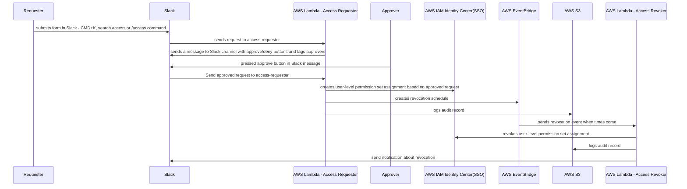

# Terraform AWS SSO Elevator

Temporary elevated access to AWS accounts via AWS IAM Identity Center (SSO) and Slack.

> **Note**: This is a fork of [FivexL/terraform-aws-sso-elevator](https://github.com/fivexl/terraform-aws-sso-elevator). Credit to FivexL for creating and maintaining the original module.

## Overview

AWS IAM Identity Center doesn't support temporary assignment of permission sets. This module enables temporary elevated access to AWS accounts, achieving the principle of least privilege access without permanently assigned permission sets.

Users request access via a Slack form. Requests are approved/denied by designated approvers. Access is automatically revoked when the time expires.

## How It Works


```mermaid
sequenceDiagram
    Requester->>Slack: submits form in Slack - CMD+K, search access or /access command
    Slack->>AWS Lambda - Access Requester: sends request to access-requester
    AWS Lambda - Access Requester->>Slack: sends a message to Slack channel with approve/deny buttons and tags approvers
    Approver->>Slack: pressed approve button in Slack message
    Slack->>AWS Lambda - Access Requester: Send approved request to access-requester
    AWS Lambda - Access Requester->>AWS IAM Identity Center(SSO): creates user-level permission set assignment based on approved request
    AWS Lambda - Access Requester->>AWS EventBridge: creates revocation schedule
    AWS Lambda - Access Requester->>AWS S3: logs audit record
    AWS EventBridge->>AWS Lambda - Access Revoker: sends revocation event when times come
    AWS Lambda - Access Revoker->>AWS IAM Identity Center(SSO): revokes user-level permission set assignment
    AWS Lambda - Access Revoker->>AWS S3: logs audit record
    AWS Lambda - Access Revoker->>Slack:  send notification about revocation
```

## Quick Start

```hcl
data "aws_ssoadmin_instances" "this" {}

data "aws_ssm_parameter" "slack_signing_secret" {
  name = "/sso-elevator/slack-signing-secret"
}

data "aws_ssm_parameter" "slack_bot_token" {
  name = "/sso-elevator/slack-bot-token"
}

module "aws_sso_elevator" {
  source = "github.com/PostHog/terraform-aws-sso-elevator"

  slack_signing_secret = data.aws_ssm_parameter.slack_signing_secret.value
  slack_bot_token      = data.aws_ssm_parameter.slack_bot_token.value
  slack_channel_id     = "C01234567"
  identity_store_id    = tolist(data.aws_ssoadmin_instances.this.identity_store_ids)[0]

  s3_logging = {
    target_bucket = "my-access-logs-bucket"
    target_prefix = "sso-elevator/"
  }

  config = [
    {
      "ResourceType" : "Account",
      "Resource" : "*",
      "PermissionSet" : "*",
      "Approvers" : ["admin@company.com"],
      "AllowSelfApproval" : true,
    },
  ]
}

output "api_endpoint_url" {
  value = module.aws_sso_elevator.requester_api_endpoint_url
}
```

## Documentation

- **[Configuration](docs/CONFIGURATION.md)** - Configuration structure, rules, explicit deny, auto-approval
- **[Group Access](docs/GROUP_ACCESS.md)** - Group assignments mode, attribute-based sync
- **[Deployment](docs/DEPLOYMENT.md)** - SSO delegation, build process, Terraform examples, Slack app setup
- **[Features](docs/FEATURES.md)** - Secondary domains, direct messages, API gateway, request expiration
- **[Cache Implementation](docs/CACHE_IMPLEMENTATION.md)** - Details on caching mechanism
- **[Athena Queries](athena_query/)** - Query audit logs with AWS Athena

## Important Considerations

- Your Slack user email must match your SSO user ID for requests to work.
- The access-revoker will revoke all user-level Permission Set assignments not created by SSO Elevator. Use group-level assignments for permanent access.
- If using `group_config`, SSO Elevator will remove users from those groups if they weren't added by SSO Elevator.

## Terraform Docs

<!-- BEGIN_TF_DOCS -->
## Requirements

| Name | Version |
|------|---------|
| <a name="requirement_terraform"></a> [terraform](#requirement\_terraform) | ~> 1.0 |
| <a name="requirement_aws"></a> [aws](#requirement\_aws) | >= 4.64 |
| <a name="requirement_external"></a> [external](#requirement\_external) | >= 1.0 |
| <a name="requirement_local"></a> [local](#requirement\_local) | >= 1.0 |
| <a name="requirement_null"></a> [null](#requirement\_null) | >= 2.0 |
| <a name="requirement_random"></a> [random](#requirement\_random) | >= 3.0 |

## Providers

| Name | Version |
|------|---------|
| <a name="provider_aws"></a> [aws](#provider\_aws) | >= 4.64 |
| <a name="provider_null"></a> [null](#provider\_null) | >= 2.0 |
| <a name="provider_random"></a> [random](#provider\_random) | >= 3.0 |

## Modules

| Name | Source | Version |
|------|--------|---------|
| <a name="module_access_requester_slack_handler"></a> [access\_requester\_slack\_handler](#module\_access\_requester\_slack\_handler) | terraform-aws-modules/lambda/aws | 8.1.2 |
| <a name="module_access_revoker"></a> [access\_revoker](#module\_access\_revoker) | terraform-aws-modules/lambda/aws | 8.1.2 |
| <a name="module_attribute_syncer"></a> [attribute\_syncer](#module\_attribute\_syncer) | terraform-aws-modules/lambda/aws | 8.1.2 |
| <a name="module_audit_bucket"></a> [audit\_bucket](#module\_audit\_bucket) | fivexl/account-baseline/aws//modules/s3_baseline | 2.0.0 |
| <a name="module_config_bucket"></a> [config\_bucket](#module\_config\_bucket) | fivexl/account-baseline/aws//modules/s3_baseline | 2.0.0 |
| <a name="module_http_api"></a> [http\_api](#module\_http\_api) | terraform-aws-modules/apigateway-v2/aws | 5.0.0 |
| <a name="module_slack_handler_alias"></a> [slack\_handler\_alias](#module\_slack\_handler\_alias) | terraform-aws-modules/lambda/aws//modules/alias | 8.1.2 |
| <a name="module_sso_elevator_dependencies"></a> [sso\_elevator\_dependencies](#module\_sso\_elevator\_dependencies) | terraform-aws-modules/lambda/aws | 8.1.2 |

## Resources

| Name | Type |
|------|------|
| [aws_cloudwatch_event_rule.attribute_sync_schedule](https://registry.terraform.io/providers/hashicorp/aws/latest/docs/resources/cloudwatch_event_rule) | resource |
| [aws_cloudwatch_event_rule.sso_elevator_check_on_inconsistency](https://registry.terraform.io/providers/hashicorp/aws/latest/docs/resources/cloudwatch_event_rule) | resource |
| [aws_cloudwatch_event_rule.sso_elevator_scheduled_revocation](https://registry.terraform.io/providers/hashicorp/aws/latest/docs/resources/cloudwatch_event_rule) | resource |
| [aws_cloudwatch_event_target.attribute_sync_schedule](https://registry.terraform.io/providers/hashicorp/aws/latest/docs/resources/cloudwatch_event_target) | resource |
| [aws_cloudwatch_event_target.check_inconsistency](https://registry.terraform.io/providers/hashicorp/aws/latest/docs/resources/cloudwatch_event_target) | resource |
| [aws_cloudwatch_event_target.sso_elevator_scheduled_revocation](https://registry.terraform.io/providers/hashicorp/aws/latest/docs/resources/cloudwatch_event_target) | resource |
| [aws_iam_role.eventbridge_role](https://registry.terraform.io/providers/hashicorp/aws/latest/docs/resources/iam_role) | resource |
| [aws_iam_role_policy.eventbridge_policy](https://registry.terraform.io/providers/hashicorp/aws/latest/docs/resources/iam_role_policy) | resource |
| [aws_lambda_permission.eventbridge](https://registry.terraform.io/providers/hashicorp/aws/latest/docs/resources/lambda_permission) | resource |
| [aws_lambda_provisioned_concurrency_config.slack_handler](https://registry.terraform.io/providers/hashicorp/aws/latest/docs/resources/lambda_provisioned_concurrency_config) | resource |
| [aws_s3_object.approval_config](https://registry.terraform.io/providers/hashicorp/aws/latest/docs/resources/s3_object) | resource |
| [aws_scheduler_schedule_group.one_time_schedule_group](https://registry.terraform.io/providers/hashicorp/aws/latest/docs/resources/scheduler_schedule_group) | resource |
| [aws_sns_topic.dlq](https://registry.terraform.io/providers/hashicorp/aws/latest/docs/resources/sns_topic) | resource |
| [aws_sns_topic_subscription.dlq](https://registry.terraform.io/providers/hashicorp/aws/latest/docs/resources/sns_topic_subscription) | resource |
| [null_resource.attribute_sync_validation](https://registry.terraform.io/providers/hashicorp/null/latest/docs/resources/resource) | resource |
| [random_string.random](https://registry.terraform.io/providers/hashicorp/random/latest/docs/resources/string) | resource |
| [aws_caller_identity.current](https://registry.terraform.io/providers/hashicorp/aws/latest/docs/data-sources/caller_identity) | data source |
| [aws_iam_policy_document.attribute_syncer](https://registry.terraform.io/providers/hashicorp/aws/latest/docs/data-sources/iam_policy_document) | data source |
| [aws_iam_policy_document.revoker](https://registry.terraform.io/providers/hashicorp/aws/latest/docs/data-sources/iam_policy_document) | data source |
| [aws_iam_policy_document.slack_handler](https://registry.terraform.io/providers/hashicorp/aws/latest/docs/data-sources/iam_policy_document) | data source |
| [aws_region.current](https://registry.terraform.io/providers/hashicorp/aws/latest/docs/data-sources/region) | data source |
| [aws_ssoadmin_instances.all](https://registry.terraform.io/providers/hashicorp/aws/latest/docs/data-sources/ssoadmin_instances) | data source |

## Inputs

| Name | Description | Type | Default | Required |
|------|-------------|------|---------|:--------:|
| <a name="input_allow_anyone_to_end_session_early"></a> [allow\_anyone\_to\_end\_session\_early](#input\_allow\_anyone\_to\_end\_session\_early) | Controls who can click the "End session early" button to revoke access before the scheduled expiration.<br/>If false (default), only the requester and approvers listed in the matching statement can end the session.<br/>If true, anyone in the Slack channel can end any session early. | `bool` | `false` | no |
| <a name="input_api_gateway_name"></a> [api\_gateway\_name](#input\_api\_gateway\_name) | The name of the API Gateway for SSO Elevator's access-requester Lambda | `string` | `"sso-elevator-access-requster"` | no |
| <a name="input_api_gateway_throttling_burst_limit"></a> [api\_gateway\_throttling\_burst\_limit](#input\_api\_gateway\_throttling\_burst\_limit) | The maximum number of requests that API Gateway allows in a burst. | `number` | `5` | no |
| <a name="input_api_gateway_throttling_rate_limit"></a> [api\_gateway\_throttling\_rate\_limit](#input\_api\_gateway\_throttling\_rate\_limit) | The maximum number of requests that API Gateway allows per second. | `number` | `1` | no |
| <a name="input_approver_renotification_backoff_multiplier"></a> [approver\_renotification\_backoff\_multiplier](#input\_approver\_renotification\_backoff\_multiplier) | The multiplier applied to the wait time for each subsequent notification sent to the approver. Default is 2, which means the wait time will double for each attempt. | `number` | `2` | no |
| <a name="input_approver_renotification_initial_wait_time"></a> [approver\_renotification\_initial\_wait\_time](#input\_approver\_renotification\_initial\_wait\_time) | The initial wait time before the first re-notification to the approver is sent. This is measured in minutes. If set to 0, no re-notifications will be sent. | `number` | `15` | no |
| <a name="input_attribute_sync_enabled"></a> [attribute\_sync\_enabled](#input\_attribute\_sync\_enabled) | Enable attribute-based group sync feature. When enabled, users will be automatically added to groups based on their Identity Store attributes. | `bool` | `false` | no |
| <a name="input_attribute_sync_event_rule_name"></a> [attribute\_sync\_event\_rule\_name](#input\_attribute\_sync\_event\_rule\_name) | Name for the EventBridge rule that triggers the attribute syncer. | `string` | `"sso-elevator-attribute-sync"` | no |
| <a name="input_attribute_sync_lambda_memory"></a> [attribute\_sync\_lambda\_memory](#input\_attribute\_sync\_lambda\_memory) | Memory allocation for attribute syncer Lambda (MB). Increase for large user/group sets. | `number` | `512` | no |
| <a name="input_attribute_sync_lambda_timeout"></a> [attribute\_sync\_lambda\_timeout](#input\_attribute\_sync\_lambda\_timeout) | Timeout for attribute syncer Lambda (seconds). Increase for large user/group sets. | `number` | `300` | no |
| <a name="input_attribute_sync_managed_groups"></a> [attribute\_sync\_managed\_groups](#input\_attribute\_sync\_managed\_groups) | List of group names to manage via attribute sync. Only these groups will be monitored and modified by the sync process. | `list(string)` | `[]` | no |
| <a name="input_attribute_sync_manual_assignment_policy"></a> [attribute\_sync\_manual\_assignment\_policy](#input\_attribute\_sync\_manual\_assignment\_policy) | Policy for handling manual assignments (users in managed groups who don't match any rules): 'warn' only logs and notifies, 'remove' automatically removes them. | `string` | `"remove"` | no |
| <a name="input_attribute_sync_rules"></a> [attribute\_sync\_rules](#input\_attribute\_sync\_rules) | Attribute mapping rules for group sync. Each rule specifies a group name and the attribute conditions that must be met for a user to be added to that group.<br/>Example:<br/>[<br/>  {<br/>    group\_name = "Engineering"<br/>    attributes = {<br/>      department = "Engineering"<br/>      employeeType = "FullTime"<br/>    }<br/>  }<br/>] | <pre>list(object({<br/>    group_name = string<br/>    attributes = map(string)<br/>  }))</pre> | `[]` | no |
| <a name="input_attribute_sync_schedule"></a> [attribute\_sync\_schedule](#input\_attribute\_sync\_schedule) | Schedule expression for attribute sync (e.g., 'rate(1 hour)' or 'cron(0 * * * ? *)'). Determines how often the sync runs. | `string` | `"rate(1 hour)"` | no |
| <a name="input_attribute_syncer_lambda_name"></a> [attribute\_syncer\_lambda\_name](#input\_attribute\_syncer\_lambda\_name) | Name for the attribute syncer Lambda function. | `string` | `"attribute-syncer"` | no |
| <a name="input_aws_sns_topic_subscription_email"></a> [aws\_sns\_topic\_subscription\_email](#input\_aws\_sns\_topic\_subscription\_email) | value for the email address to subscribe to the SNS topic | `string` | `""` | no |
| <a name="input_cache_enabled"></a> [cache\_enabled](#input\_cache\_enabled) | Enable caching of AWS accounts and permission sets in S3. If set to false, caching is disabled but the S3 bucket will still be created for future config storage. | `bool` | `true` | no |
| <a name="input_config"></a> [config](#input\_config) | value for the SSO Elevator config | `any` | `[]` | no |
| <a name="input_config_bucket_kms_key_arn"></a> [config\_bucket\_kms\_key\_arn](#input\_config\_bucket\_kms\_key\_arn) | ARN of the KMS key to use for config S3 bucket encryption. If not provided, uses AES256 encryption. | `string` | `null` | no |
| <a name="input_config_bucket_name"></a> [config\_bucket\_name](#input\_config\_bucket\_name) | Name of the S3 bucket for storing configuration and cache data (accounts, permission sets, and future config files) | `string` | `"sso-elevator-config"` | no |
| <a name="input_create_api_gateway"></a> [create\_api\_gateway](#input\_create\_api\_gateway) | If true, module will create & configure API Gateway for the Lambda function | `bool` | `true` | no |
| <a name="input_ecr_owner_account_id"></a> [ecr\_owner\_account\_id](#input\_ecr\_owner\_account\_id) | In what account is the ECR repository located. | `string` | `"222341826240"` | no |
| <a name="input_ecr_repo_name"></a> [ecr\_repo\_name](#input\_ecr\_repo\_name) | The name of the ECR repository. | `string` | `"aws-sso-elevator"` | no |
| <a name="input_ecr_repo_tag"></a> [ecr\_repo\_tag](#input\_ecr\_repo\_tag) | The tag of the image in the ECR repository. | `string` | `"4.1.0"` | no |
| <a name="input_event_bridge_check_on_inconsistency_rule_name"></a> [event\_bridge\_check\_on\_inconsistency\_rule\_name](#input\_event\_bridge\_check\_on\_inconsistency\_rule\_name) | value for the event bridge check on inconsistency rule name | `string` | `null` | no |
| <a name="input_event_bridge_scheduled_revocation_rule_name"></a> [event\_bridge\_scheduled\_revocation\_rule\_name](#input\_event\_bridge\_scheduled\_revocation\_rule\_name) | value for the event bridge scheduled revocation rule name | `string` | `null` | no |
| <a name="input_event_brige_check_on_inconsistency_rule_name"></a> [event\_brige\_check\_on\_inconsistency\_rule\_name](#input\_event\_brige\_check\_on\_inconsistency\_rule\_name) | DEPRECATED: Use event\_bridge\_check\_on\_inconsistency\_rule\_name instead. This variable contains a typo and will be removed in a future version. | `string` | `"sso-elevator-check-on-inconsistency"` | no |
| <a name="input_event_brige_scheduled_revocation_rule_name"></a> [event\_brige\_scheduled\_revocation\_rule\_name](#input\_event\_brige\_scheduled\_revocation\_rule\_name) | DEPRECATED: Use event\_bridge\_scheduled\_revocation\_rule\_name instead. This variable contains a typo and will be removed in a future version. | `string` | `"sso-elevator-scheduled-revocation"` | no |
| <a name="input_group_config"></a> [group\_config](#input\_group\_config) | value for the SSO Elevator group config | `any` | `[]` | no |
| <a name="input_identity_store_id"></a> [identity\_store\_id](#input\_identity\_store\_id) | The Identity Store ID (e.g., "d-1234567890").<br/>If not provided and sso\_instance\_arn is also not provided, it will be automatically discovered.<br/><br/>Providing this value is RECOMMENDED for API efficiency - it eliminates describe\_sso\_instance API calls<br/>on every Lambda invocation. You can find this value in the AWS IAM Identity Center console or via:<br/>  aws sso-admin list-instances --query 'Instances[0].IdentityStoreId' --output text | `string` | `""` | no |
| <a name="input_lambda_architecture"></a> [lambda\_architecture](#input\_lambda\_architecture) | The instruction set architecture for Lambda functions. Valid values are 'x86\_64' or 'arm64'. Use 'arm64' for better price/performance on Graviton2. | `string` | `"x86_64"` | no |
| <a name="input_lambda_memory_size"></a> [lambda\_memory\_size](#input\_lambda\_memory\_size) | Amount of memory in MB your Lambda Function can use at runtime. Valid value between 128 MB to 10,240 MB (10 GB), in 64 MB increments. | `number` | `256` | no |
| <a name="input_lambda_timeout"></a> [lambda\_timeout](#input\_lambda\_timeout) | The amount of time your Lambda Function has to run in seconds. | `number` | `30` | no |
| <a name="input_log_level"></a> [log\_level](#input\_log\_level) | value for the log level | `string` | `"INFO"` | no |
| <a name="input_logs_retention_in_days"></a> [logs\_retention\_in\_days](#input\_logs\_retention\_in\_days) | The number of days you want to retain log events in the log group for both Lambda functions and API Gateway. | `number` | `365` | no |
| <a name="input_max_permissions_duration_time"></a> [max\_permissions\_duration\_time](#input\_max\_permissions\_duration\_time) | Maximum duration (in hours) for permissions granted by Elevator. Max number - 48 hours.<br/>  Due to Slack's dropdown limit of 100 items, anything above 48 hours will cause issues when generating half-hour increments<br/>  and Elevator will not display more then 48 hours in the dropdown. | `number` | `24` | no |
| <a name="input_permission_duration_list_override"></a> [permission\_duration\_list\_override](#input\_permission\_duration\_list\_override) | An explicit list of duration values to appear in the drop-down menu users use to select how long to request permissions for.<br/>  Each entry in the list should be formatted as "hh:mm", e.g. "01:30" for an hour and a half. Note that while the number of minutes<br/>  must be between 0-59, the number of hours can be any number.<br/>  If this variable is set, the max\_permission\_duration\_time is ignored. | `list(string)` | `[]` | no |
| <a name="input_posthog_api_key"></a> [posthog\_api\_key](#input\_posthog\_api\_key) | PostHog API key for analytics. Leave empty to disable analytics tracking. | `string` | `""` | no |
| <a name="input_posthog_host"></a> [posthog\_host](#input\_posthog\_host) | PostHog host URL for analytics. | `string` | `"https://us.i.posthog.com"` | no |
| <a name="input_request_expiration_hours"></a> [request\_expiration\_hours](#input\_request\_expiration\_hours) | After how many hours should the request expire? If set to 0, the request will never expire. | `number` | `8` | no |
| <a name="input_requester_lambda_name"></a> [requester\_lambda\_name](#input\_requester\_lambda\_name) | value for the requester lambda name | `string` | `"access-requester"` | no |
| <a name="input_revoker_lambda_name"></a> [revoker\_lambda\_name](#input\_revoker\_lambda\_name) | value for the revoker lambda name | `string` | `"access-revoker"` | no |
| <a name="input_revoker_post_update_to_slack"></a> [revoker\_post\_update\_to\_slack](#input\_revoker\_post\_update\_to\_slack) | Should revoker send a confirmation of the revocation to Slack? | `bool` | `true` | no |
| <a name="input_s3_bucket_name_for_audit_entry"></a> [s3\_bucket\_name\_for\_audit\_entry](#input\_s3\_bucket\_name\_for\_audit\_entry) | The name of the S3 bucket that will be used by the module to store logs about every access request.<br/>  If s3\_name\_of\_the\_existing\_bucket is not provided, the module will create a new bucket with this name. | `string` | `"sso-elevator-audit-entry"` | no |
| <a name="input_s3_bucket_partition_prefix"></a> [s3\_bucket\_partition\_prefix](#input\_s3\_bucket\_partition\_prefix) | The prefix for the S3 audit bucket object partitions.<br/>  Don't use slashes (/) in the prefix, as it will be added automatically, e.g. "logs" will be transformed to "logs/".<br/>  If you want to use the root of the bucket, leave this empty. | `string` | `"logs"` | no |
| <a name="input_s3_logging"></a> [s3\_logging](#input\_s3\_logging) | Map containing access bucket logging configuration.<br/>  If you are not providing s3\_name\_of\_the\_existing\_bucket variable, then module will create bucket for you.<br/>  If the module is creating an audit bucket for you, then you must provide a logging configuration via this input variable, with at least the target\_bucket key specified. | `map(string)` | `{}` | no |
| <a name="input_s3_mfa_delete"></a> [s3\_mfa\_delete](#input\_s3\_mfa\_delete) | Whether to enable MFA delete for the S3 bucket | `bool` | `false` | no |
| <a name="input_s3_name_of_the_existing_bucket"></a> [s3\_name\_of\_the\_existing\_bucket](#input\_s3\_name\_of\_the\_existing\_bucket) | Name of an existing S3 bucket to use for storing SSO Elevator audit logs.<br/>  An audit log bucket is mandatory.<br/>  If you specify this variable, the module will use your existing bucket.<br/>  Otherwise, if you don't provide this variable, the module will create a new bucket named according to the "s3\_bucket\_name\_for\_audit\_entry" variable.<br/>  If the module is creating an audit bucket for you, then you must provide a logging configuration via the s3\_logging input variable, with at least the target\_bucket key specified. | `string` | `""` | no |
| <a name="input_s3_object_lock"></a> [s3\_object\_lock](#input\_s3\_object\_lock) | Enable object lock | `bool` | `false` | no |
| <a name="input_s3_object_lock_configuration"></a> [s3\_object\_lock\_configuration](#input\_s3\_object\_lock\_configuration) | Object lock configuration | `any` | <pre>{<br/>  "rule": {<br/>    "default_retention": {<br/>      "mode": "GOVERNANCE",<br/>      "years": 2<br/>    }<br/>  }<br/>}</pre> | no |
| <a name="input_schedule_expression"></a> [schedule\_expression](#input\_schedule\_expression) | recovation schedule expression (will revoke all user-level assignments unknown to the Elevator) | `string` | `"cron(0 23 * * ? *)"` | no |
| <a name="input_schedule_expression_for_check_on_inconsistency"></a> [schedule\_expression\_for\_check\_on\_inconsistency](#input\_schedule\_expression\_for\_check\_on\_inconsistency) | how often revoker should check for inconsistency (warn if found unknown user-level assignments) | `string` | `"rate(2 hours)"` | no |
| <a name="input_schedule_group_name"></a> [schedule\_group\_name](#input\_schedule\_group\_name) | value for the schedule group name | `string` | `"sso-elevator-scheduled-revocation"` | no |
| <a name="input_schedule_role_name"></a> [schedule\_role\_name](#input\_schedule\_role\_name) | value for the schedule role name | `string` | `"sso-elevator-event-bridge-role"` | no |
| <a name="input_secondary_fallback_email_domains"></a> [secondary\_fallback\_email\_domains](#input\_secondary\_fallback\_email\_domains) | Value example: ["@new.domain", "@second.domain"], every domain name should start with "@".<br/>WARNING: <br/>This feature is STRONGLY DISCOURAGED because it can introduce security risks and open up potential avenues for abuse.<br/><br/>SSO Elevator uses Slack email addresses to find users in AWS SSO. In some cases, the domain of a Slack user's email <br/>(e.g., "john.doe@old.domain") differs from the domain defined in AWS SSO (e.g., "john.doe@new.domain"). By setting <br/>these fallback domains, SSO Elevator will attempt to replace the original domain from Slack with each secondary domain <br/>in order to locate a matching AWS SSO user. <br/> <br/>Use Cases:<br/>- This mechanism should only be used in rare or critical situations where you cannot align Slack and AWS SSO domains.<br/><br/>Use Case Example:<br/>- Slack email: john.doe@old.domain<br/>- AWS SSO email: john.doe@new.domain<br/><br/>Without fallback domains, SSO Elevator cannot find the SSO user due to the domain mismatch. By setting <br/>secondary\_fallback\_email\_domains = ["@new.domain"], SSO Elevator will swap out "@old.domain" for "@new.domain"<br/>(and any other domain in the list) and attempt to locate "john.doe@new.domain" in AWS SSO.<br/><br/>Security Risks & Recommendations:<br/>- If multiple SSO users share the same local-part (before the "@") across different domains, SSO Elevator may <br/>  grant permissions to the wrong user.<br/>- Disable or remove entries in this variable as soon as you no longer need domain fallback functionality <br/>  to restore a more secure configuration.<br/><br/>IN SUMMARY:<br/>Use "secondary\_fallback\_email\_domains" ONLY if absolutely necessary. It is best practice to maintain <br/>consistent, verified email domains in Slack and AWS SSO. Remove these fallback entries as soon as you <br/>resolve the underlying domain mismatch to minimize security exposure.<br/><br/>Notes:<br/>- SSO Elevator always prioritizes the primary domain from Slack (the Slack user's email) when searching for a user in AWS SSO.<br/>- SSO Elevator adds a large warning message in Slack if it uses a secondary fallback domain to find a user in AWS SSO.<br/>- The secondary domain feature works **ONLY** for the requester, approvers in the configuration must have the same email domain as in Slack. | `list(string)` | `[]` | no |
| <a name="input_send_dm_if_user_not_in_channel"></a> [send\_dm\_if\_user\_not\_in\_channel](#input\_send\_dm\_if\_user\_not\_in\_channel) | If the user is not in the SSO Elevator channel, Elevator will send them a direct message with the request status <br/>(waiting for approval, declined, approved, etc.) and the result of the request.<br/>Using this feature requires the following Slack app permissions: "channels:read", "groups:read", and "im:write". <br/>Please ensure these permissions are enabled in the Slack app configuration. | `bool` | `true` | no |
| <a name="input_slack_bot_token"></a> [slack\_bot\_token](#input\_slack\_bot\_token) | value for the Slack bot token | `string` | n/a | yes |
| <a name="input_slack_channel_id"></a> [slack\_channel\_id](#input\_slack\_channel\_id) | value for the Slack channel ID | `string` | n/a | yes |
| <a name="input_slack_handler_provisioned_concurrent_executions"></a> [slack\_handler\_provisioned\_concurrent\_executions](#input\_slack\_handler\_provisioned\_concurrent\_executions) | Provisioned concurrent executions for the Slack handler Lambda. Set to a positive number to reduce cold starts. | `number` | `-1` | no |
| <a name="input_slack_signing_secret"></a> [slack\_signing\_secret](#input\_slack\_signing\_secret) | value for the Slack signing secret | `string` | n/a | yes |
| <a name="input_sso_instance_arn"></a> [sso\_instance\_arn](#input\_sso\_instance\_arn) | value for the SSO instance ARN | `string` | `""` | no |
| <a name="input_tags"></a> [tags](#input\_tags) | A map of tags to assign to resources. | `map(string)` | `{}` | no |
| <a name="input_use_pre_created_image"></a> [use\_pre\_created\_image](#input\_use\_pre\_created\_image) | If true, the image will be pulled from the ECR repository. If false, the image will be built using Docker from the source code. | `bool` | `true` | no |

## Outputs

| Name | Description |
|------|-------------|
| <a name="output_attribute_sync_schedule_rule_arn"></a> [attribute\_sync\_schedule\_rule\_arn](#output\_attribute\_sync\_schedule\_rule\_arn) | The ARN of the EventBridge rule that triggers the attribute syncer. |
| <a name="output_attribute_syncer_lambda_arn"></a> [attribute\_syncer\_lambda\_arn](#output\_attribute\_syncer\_lambda\_arn) | The ARN of the attribute syncer Lambda function. |
| <a name="output_attribute_syncer_lambda_name"></a> [attribute\_syncer\_lambda\_name](#output\_attribute\_syncer\_lambda\_name) | The name of the attribute syncer Lambda function. |
| <a name="output_config_s3_bucket_arn"></a> [config\_s3\_bucket\_arn](#output\_config\_s3\_bucket\_arn) | The ARN of the S3 bucket for storing configuration and cache data. |
| <a name="output_config_s3_bucket_name"></a> [config\_s3\_bucket\_name](#output\_config\_s3\_bucket\_name) | The name of the S3 bucket for storing configuration and cache data. |
| <a name="output_requester_api_endpoint_url"></a> [requester\_api\_endpoint\_url](#output\_requester\_api\_endpoint\_url) | The full URL to invoke the API. Pass this URL into the Slack App manifest as the Request URL. |
| <a name="output_revoker_lambda_name"></a> [revoker\_lambda\_name](#output\_revoker\_lambda\_name) | The name of the revoker Lambda function. |
| <a name="output_schedule_group_name"></a> [schedule\_group\_name](#output\_schedule\_group\_name) | The name of the EventBridge Scheduler schedule group. |
| <a name="output_sso_elevator_bucket_id"></a> [sso\_elevator\_bucket\_id](#output\_sso\_elevator\_bucket\_id) | The name of the SSO elevator bucket. |
<!-- END_TF_DOCS -->

## More Info

- [Permission Set](https://docs.aws.amazon.com/singlesignon/latest/userguide/permissionsetsconcept.html)
- [User and groups](https://docs.aws.amazon.com/singlesignon/latest/userguide/users-groups-provisioning.html)
