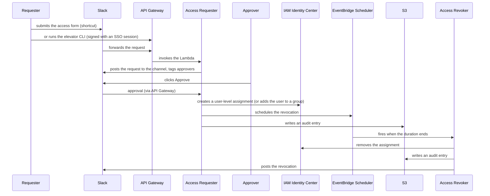

[](https://fivexl.io/#email-subscription)

### Want practical AWS infrastructure insights?

👉 [Subscribe to our newsletter](https://fivexl.io/#email-subscription) to get:

- Real stories from real AWS projects  
- No-nonsense DevOps tactics  
- Cost, security & compliance patterns that actually work  
- Expert guidance from engineers in the field

=========================================================================

# Terraform Module for Temporary Elevated Access via AWS IAM Identity Center (Successor to AWS Single Sign-On) and Slack

AWS IAM Identity Center has no temporary permission set assignments. Teams end up with either tightly restricted permission sets or IAM role chaining, and both make the security model complex. The better default is no access (or read-only), with more granted only when needed and only for as long as needed.

SSO Elevator does that. People request a permission set in an account, or membership in a group, from Slack or from the command line. Approvers approve in Slack. The module grants the access and removes it when the requested duration ends. Every grant, revocation and declined request is written to an S3 audit log.

AWS describes its own approach in [Managing temporary elevated access to your AWS environment](https://aws.amazon.com/blogs/security/managing-temporary-elevated-access-to-your-aws-environment/). SSO Elevator differs mainly in using Slack as the request and approval interface. Several AWS partners also offer temporary access for IAM Identity Center ([CyberArk Secure Cloud Access, Ermetic and Okta Access Requests](https://aws.amazon.com/about-aws/whats-new/2023/05/aws-partners-temporary-elevated-access-capabilities-iam-identity-center/)). If you already use one of them, check their offering first.

Watch demo
[](https://youtu.be/iR3Rdjd7QMU)

## How It Works


```mermaid
sequenceDiagram
    Requester->>Slack: submits the access form (shortcut)
    Requester->>API Gateway: or runs the elevator CLI (signed with an SSO session)
    Slack->>API Gateway: forwards the request
    API Gateway->>Access Requester: invokes the Lambda
    Access Requester->>Slack: posts the request to the channel, tags approvers
    Approver->>Slack: clicks Approve
    Slack->>Access Requester: approval (via API Gateway)
    Access Requester->>IAM Identity Center: creates a user-level assignment (or adds the user to a group)
    Access Requester->>EventBridge Scheduler: schedules the revocation
    Access Requester->>S3: writes an audit entry
    EventBridge Scheduler->>Access Revoker: fires when the duration ends
    Access Revoker->>IAM Identity Center: removes the assignment
    Access Revoker->>S3: writes an audit entry
    Access Revoker->>Slack: posts the revocation
```

- **Two ways to ask, one pipeline.** Slack and the [`elevator` CLI](https://github.com/fivexl/terraform-aws-sso-elevator/blob/main/cmd/elevator/README.md) both call one REST API in front of the access-requester Lambda. CLI requests go through the same approval rules and are posted to the same Slack channel for approval. The CLI requests account access only.
- **Approval rules** in Terraform (`config`, `group_config`) decide per account, permission set or group who approves, whether approval is needed, and whether people may approve their own requests.
- **Revocation.** Each grant gets a one-time EventBridge Scheduler schedule that triggers the access-revoker Lambda. The revoker also runs a sweep (`schedule_expression`, nightly by default) that removes access nobody scheduled for removal. A check (`schedule_expression_for_check_on_inconsistency`, every 2 hours by default) warns about such access in Slack.
- **Audit.** Grants, revocations, declined requests and approved requests that failed partway are stored in S3 and can be queried with Athena. Audit writes never block access expiry: if S3 fails, access is still revoked on time and the entry goes to CloudWatch Logs instead.
- **Optional:** [attribute-based group sync](https://github.com/fivexl/terraform-aws-sso-elevator/blob/main/docs/attribute-sync.md) keeps group membership in line with Identity Store user attributes.

## Important Considerations

- **The revoker removes user-level assignments it did not create.** In every account named by an approval rule, it removes user-level assignments of the permission sets the rules name that have no pending revocation schedule. A rule with `"Resource": "*"` extends this to all accounts, and one with `"PermissionSet": "*"` to all permission sets. Give permanent access (read-only in production, admin in sandboxes) by assigning permission sets to groups, which the revoker never touches. Before you deploy, make sure your administrators reach the IAM Identity Center account through a group.
- **The same goes for groups.** Members of a group in `group_config` who have no pending revocation schedule are removed, however they were added.
- **Users are matched by email.** The requester's Slack email must equal the email of their IAM Identity Center user (or match it under one of `secondary_fallback_email_domains`). CLI callers are matched the other way: SSO username, then that user's email, then the Slack user with that email.
- **AWS Organization.** The CLI route, on by default, needs the deployment account to be in an AWS Organization and admits callers from any account in it. Set `enable_access_requester_cli = false` if you only use Slack. See [docs/cli.md](https://github.com/fivexl/terraform-aws-sso-elevator/blob/main/docs/cli.md).
- **Slack is required** for both paths: approvals happen there.

## Quickstart

Deploy into the IAM Identity Center management account or its [delegated administrator account](https://github.com/fivexl/terraform-aws-sso-elevator/blob/main/docs/deployment.md):

```terraform
module "aws_sso_elevator" {
  source  = "fivexl/sso-elevator/aws"
  version = "5.0.0"

  slack_channel_id = "C0123456789"

  # Always required: access logging for the config bucket, and for the audit
  # bucket unless you set s3_name_of_the_existing_bucket.
  s3_logging = {
    target_bucket = "my-s3-access-logs-bucket"
    target_prefix = "sso-elevator/"
  }

  config = [
    {
      "ResourceType" : "Account",
      # One account to start. "*" makes the revoker act in every account:
      # read "Important Considerations" first.
      "Resource" : ["111111111111"],
      "PermissionSet" : "ReadOnlyAccess",
      "Approvers" : ["lead@example.com"],
      "AllowSelfApproval" : true,
    },
  ]
}

output "requester_api_endpoint_url" {
  value = module.aws_sso_elevator.requester_api_endpoint_url
}

output "requester_api_endpoint_url_cli" {
  value = module.aws_sso_elevator.requester_api_endpoint_url_cli
}
```

Then:

1. Create the Slack app and point it at the `requester_api_endpoint_url` output. Then write the bot token and signing secret to SSM: [docs/slack.md](https://github.com/fivexl/terraform-aws-sso-elevator/blob/main/docs/slack.md).
2. Write your approval rules: [docs/configuration.md](https://github.com/fivexl/terraform-aws-sso-elevator/blob/main/docs/configuration.md).
3. For a fuller module block and the image options: [docs/deployment.md](https://github.com/fivexl/terraform-aws-sso-elevator/blob/main/docs/deployment.md).

## Upgrading to 5.0

5.0.0 has breaking changes. It raises the Terraform and AWS provider minimums, removes inputs, moves the Slack secrets to SSM, changes the Slack and CLI URLs, and requires CLI 5.0.0 or newer. From 4.x, follow [UPGRADE-5.0.md](https://github.com/fivexl/terraform-aws-sso-elevator/blob/main/UPGRADE-5.0.md). On 3.x or older, upgrade to 4.4.3 first ([UPGRADE-4.0.md](https://github.com/fivexl/terraform-aws-sso-elevator/blob/main/UPGRADE-4.0.md)).

## Documentation

- [Configuration](https://github.com/fivexl/terraform-aws-sso-elevator/blob/main/docs/configuration.md): approval rules, group assignments, secondary email domains, direct messages
- [Attribute-based group sync](https://github.com/fivexl/terraform-aws-sso-elevator/blob/main/docs/attribute-sync.md)
- [Slack](https://github.com/fivexl/terraform-aws-sso-elevator/blob/main/docs/slack.md): app creation and manifest, secrets in SSM, rotation
- [CLI, operator side](https://github.com/fivexl/terraform-aws-sso-elevator/blob/main/docs/cli.md): requirements and trust model. End users: [cmd/elevator/README.md](https://github.com/fivexl/terraform-aws-sso-elevator/blob/main/cmd/elevator/README.md)
- [API Gateway](https://github.com/fivexl/terraform-aws-sso-elevator/blob/main/docs/api-gateway.md): REST API, WAF, SnapStart, access logs
- [Deployment](https://github.com/fivexl/terraform-aws-sso-elevator/blob/main/docs/deployment.md): SSO delegation, images and regions, Terraform example
- [Architecture](https://github.com/fivexl/terraform-aws-sso-elevator/blob/main/docs/architecture.md): request flow, caching, outage behaviour
- [Audit](https://github.com/fivexl/terraform-aws-sso-elevator/blob/main/docs/audit.md): Athena table and queries
- [Accepted risks](https://github.com/fivexl/terraform-aws-sso-elevator/blob/main/docs/accepted-risks.md)
- [Changelog](https://github.com/fivexl/terraform-aws-sso-elevator/blob/main/CHANGELOG.md), [UPGRADE-5.0.md](https://github.com/fivexl/terraform-aws-sso-elevator/blob/main/UPGRADE-5.0.md), [UPGRADE-4.0.md](https://github.com/fivexl/terraform-aws-sso-elevator/blob/main/UPGRADE-4.0.md)
- Contributors: [development](https://github.com/fivexl/terraform-aws-sso-elevator/blob/main/docs/development.md), [releasing](https://github.com/fivexl/terraform-aws-sso-elevator/blob/main/docs/releasing.md), [release testing](https://github.com/fivexl/terraform-aws-sso-elevator/blob/main/docs/release-testing.md)

# Terraform Docs

<!-- BEGIN_TF_DOCS -->
## Requirements

| Name | Version |
| ---- | ------- |
| <a name="requirement_terraform"></a> [terraform](#requirement\_terraform) | ~> 1.11 |
| <a name="requirement_aws"></a> [aws](#requirement\_aws) | >= 6.28 |
| <a name="requirement_external"></a> [external](#requirement\_external) | >= 1.0 |
| <a name="requirement_local"></a> [local](#requirement\_local) | >= 1.0 |
| <a name="requirement_null"></a> [null](#requirement\_null) | >= 2.0 |
| <a name="requirement_random"></a> [random](#requirement\_random) | >= 3.0 |

## Providers

| Name | Version |
| ---- | ------- |
| <a name="provider_aws"></a> [aws](#provider\_aws) | >= 6.28 |
| <a name="provider_null"></a> [null](#provider\_null) | >= 2.0 |
| <a name="provider_random"></a> [random](#provider\_random) | >= 3.0 |

## Modules

| Name | Source | Version |
| ---- | ------ | ------- |
| <a name="module_access_requester_alias"></a> [access\_requester\_alias](#module\_access\_requester\_alias) | terraform-aws-modules/lambda/aws//modules/alias | 8.8.2 |
| <a name="module_access_requester_slack_handler"></a> [access\_requester\_slack\_handler](#module\_access\_requester\_slack\_handler) | terraform-aws-modules/lambda/aws | 8.8.2 |
| <a name="module_access_revoker"></a> [access\_revoker](#module\_access\_revoker) | terraform-aws-modules/lambda/aws | 8.8.2 |
| <a name="module_attribute_syncer"></a> [attribute\_syncer](#module\_attribute\_syncer) | terraform-aws-modules/lambda/aws | 8.8.2 |
| <a name="module_audit_bucket"></a> [audit\_bucket](#module\_audit\_bucket) | fivexl/account-baseline/aws//modules/s3_baseline | 2.1.6 |
| <a name="module_config_bucket"></a> [config\_bucket](#module\_config\_bucket) | fivexl/account-baseline/aws//modules/s3_baseline | 2.1.6 |
| <a name="module_sso_elevator_dependencies"></a> [sso\_elevator\_dependencies](#module\_sso\_elevator\_dependencies) | terraform-aws-modules/lambda/aws | 8.8.2 |

## Resources

| Name | Type |
| ---- | ---- |
| [aws_api_gateway_deployment.requester](https://registry.terraform.io/providers/hashicorp/aws/latest/docs/resources/api_gateway_deployment) | resource |
| [aws_api_gateway_integration.cli](https://registry.terraform.io/providers/hashicorp/aws/latest/docs/resources/api_gateway_integration) | resource |
| [aws_api_gateway_integration.slack](https://registry.terraform.io/providers/hashicorp/aws/latest/docs/resources/api_gateway_integration) | resource |
| [aws_api_gateway_method.cli](https://registry.terraform.io/providers/hashicorp/aws/latest/docs/resources/api_gateway_method) | resource |
| [aws_api_gateway_method.slack](https://registry.terraform.io/providers/hashicorp/aws/latest/docs/resources/api_gateway_method) | resource |
| [aws_api_gateway_method_settings.cli](https://registry.terraform.io/providers/hashicorp/aws/latest/docs/resources/api_gateway_method_settings) | resource |
| [aws_api_gateway_method_settings.slack](https://registry.terraform.io/providers/hashicorp/aws/latest/docs/resources/api_gateway_method_settings) | resource |
| [aws_api_gateway_request_validator.slack](https://registry.terraform.io/providers/hashicorp/aws/latest/docs/resources/api_gateway_request_validator) | resource |
| [aws_api_gateway_resource.cli](https://registry.terraform.io/providers/hashicorp/aws/latest/docs/resources/api_gateway_resource) | resource |
| [aws_api_gateway_resource.slack](https://registry.terraform.io/providers/hashicorp/aws/latest/docs/resources/api_gateway_resource) | resource |
| [aws_api_gateway_rest_api.requester](https://registry.terraform.io/providers/hashicorp/aws/latest/docs/resources/api_gateway_rest_api) | resource |
| [aws_api_gateway_rest_api_policy.requester](https://registry.terraform.io/providers/hashicorp/aws/latest/docs/resources/api_gateway_rest_api_policy) | resource |
| [aws_api_gateway_stage.requester](https://registry.terraform.io/providers/hashicorp/aws/latest/docs/resources/api_gateway_stage) | resource |
| [aws_cloudwatch_event_rule.attribute_sync_schedule](https://registry.terraform.io/providers/hashicorp/aws/latest/docs/resources/cloudwatch_event_rule) | resource |
| [aws_cloudwatch_event_rule.sso_elevator_check_on_inconsistency](https://registry.terraform.io/providers/hashicorp/aws/latest/docs/resources/cloudwatch_event_rule) | resource |
| [aws_cloudwatch_event_rule.sso_elevator_scheduled_revocation](https://registry.terraform.io/providers/hashicorp/aws/latest/docs/resources/cloudwatch_event_rule) | resource |
| [aws_cloudwatch_event_target.attribute_sync_schedule](https://registry.terraform.io/providers/hashicorp/aws/latest/docs/resources/cloudwatch_event_target) | resource |
| [aws_cloudwatch_event_target.check_inconsistency](https://registry.terraform.io/providers/hashicorp/aws/latest/docs/resources/cloudwatch_event_target) | resource |
| [aws_cloudwatch_event_target.sso_elevator_scheduled_revocation](https://registry.terraform.io/providers/hashicorp/aws/latest/docs/resources/cloudwatch_event_target) | resource |
| [aws_cloudwatch_log_group.api_access_logs](https://registry.terraform.io/providers/hashicorp/aws/latest/docs/resources/cloudwatch_log_group) | resource |
| [aws_cloudwatch_log_group.waf](https://registry.terraform.io/providers/hashicorp/aws/latest/docs/resources/cloudwatch_log_group) | resource |
| [aws_iam_role.eventbridge_role](https://registry.terraform.io/providers/hashicorp/aws/latest/docs/resources/iam_role) | resource |
| [aws_iam_role_policy.eventbridge_policy](https://registry.terraform.io/providers/hashicorp/aws/latest/docs/resources/iam_role_policy) | resource |
| [aws_lambda_function_event_invoke_config.access_requester_live](https://registry.terraform.io/providers/hashicorp/aws/latest/docs/resources/lambda_function_event_invoke_config) | resource |
| [aws_lambda_permission.api_gateway](https://registry.terraform.io/providers/hashicorp/aws/latest/docs/resources/lambda_permission) | resource |
| [aws_s3_object.approval_config](https://registry.terraform.io/providers/hashicorp/aws/latest/docs/resources/s3_object) | resource |
| [aws_scheduler_schedule_group.one_time_schedule_group](https://registry.terraform.io/providers/hashicorp/aws/latest/docs/resources/scheduler_schedule_group) | resource |
| [aws_sns_topic.dlq](https://registry.terraform.io/providers/hashicorp/aws/latest/docs/resources/sns_topic) | resource |
| [aws_sns_topic_subscription.dlq](https://registry.terraform.io/providers/hashicorp/aws/latest/docs/resources/sns_topic_subscription) | resource |
| [aws_ssm_parameter.slack_bot_token](https://registry.terraform.io/providers/hashicorp/aws/latest/docs/resources/ssm_parameter) | resource |
| [aws_ssm_parameter.slack_signing_secret](https://registry.terraform.io/providers/hashicorp/aws/latest/docs/resources/ssm_parameter) | resource |
| [aws_wafv2_web_acl.requester](https://registry.terraform.io/providers/hashicorp/aws/latest/docs/resources/wafv2_web_acl) | resource |
| [aws_wafv2_web_acl_association.requester](https://registry.terraform.io/providers/hashicorp/aws/latest/docs/resources/wafv2_web_acl_association) | resource |
| [aws_wafv2_web_acl_logging_configuration.requester](https://registry.terraform.io/providers/hashicorp/aws/latest/docs/resources/wafv2_web_acl_logging_configuration) | resource |
| [null_resource.attribute_sync_validation](https://registry.terraform.io/providers/hashicorp/null/latest/docs/resources/resource) | resource |
| [random_string.random](https://registry.terraform.io/providers/hashicorp/random/latest/docs/resources/string) | resource |
| [aws_caller_identity.current](https://registry.terraform.io/providers/hashicorp/aws/latest/docs/data-sources/caller_identity) | data source |
| [aws_iam_policy_document.attribute_syncer](https://registry.terraform.io/providers/hashicorp/aws/latest/docs/data-sources/iam_policy_document) | data source |
| [aws_iam_policy_document.read_slack_secrets](https://registry.terraform.io/providers/hashicorp/aws/latest/docs/data-sources/iam_policy_document) | data source |
| [aws_iam_policy_document.revoker](https://registry.terraform.io/providers/hashicorp/aws/latest/docs/data-sources/iam_policy_document) | data source |
| [aws_iam_policy_document.schedule_access](https://registry.terraform.io/providers/hashicorp/aws/latest/docs/data-sources/iam_policy_document) | data source |
| [aws_iam_policy_document.slack_handler](https://registry.terraform.io/providers/hashicorp/aws/latest/docs/data-sources/iam_policy_document) | data source |
| [aws_organizations_organization.current](https://registry.terraform.io/providers/hashicorp/aws/latest/docs/data-sources/organizations_organization) | data source |
| [aws_partition.current](https://registry.terraform.io/providers/hashicorp/aws/latest/docs/data-sources/partition) | data source |
| [aws_region.current](https://registry.terraform.io/providers/hashicorp/aws/latest/docs/data-sources/region) | data source |
| [aws_ssoadmin_instances.all](https://registry.terraform.io/providers/hashicorp/aws/latest/docs/data-sources/ssoadmin_instances) | data source |

## Inputs

| Name | Description | Type | Default | Required |
| ---- | ----------- | ---- | ------- | :------: |
| <a name="input_api_gateway_access_logs_enabled"></a> [api\_gateway\_access\_logs\_enabled](#input\_api\_gateway\_access\_logs\_enabled) | If true, the module creates a CloudWatch log group and enables access logging on the requester API stage. Requires the account's API Gateway CloudWatch Logs role (aws\_api\_gateway\_account) to be set already; the module does not manage it. | `bool` | `false` | no |
| <a name="input_api_gateway_name"></a> [api\_gateway\_name](#input\_api\_gateway\_name) | The name of the API Gateway for SSO Elevator's access-requester Lambda | `string` | `"sso-elevator-access-requster"` | no |
| <a name="input_api_gateway_throttling_burst_limit"></a> [api\_gateway\_throttling\_burst\_limit](#input\_api\_gateway\_throttling\_burst\_limit) | The maximum number of requests that API Gateway allows in a burst. | `number` | `5` | no |
| <a name="input_api_gateway_throttling_rate_limit"></a> [api\_gateway\_throttling\_rate\_limit](#input\_api\_gateway\_throttling\_rate\_limit) | The maximum number of requests that API Gateway allows per second. | `number` | `1` | no |
| <a name="input_approver_renotification_backoff_multiplier"></a> [approver\_renotification\_backoff\_multiplier](#input\_approver\_renotification\_backoff\_multiplier) | The multiplier applied to the wait time for each subsequent notification sent to the approver. Default is 2, which means the wait time will double for each attempt. | `number` | `2` | no |
| <a name="input_approver_renotification_initial_wait_time"></a> [approver\_renotification\_initial\_wait\_time](#input\_approver\_renotification\_initial\_wait\_time) | The initial wait time before the first re-notification to the approver is sent. This is measured in minutes. If set to 0, no re-notifications will be sent. | `number` | `15` | no |
| <a name="input_attribute_sync_enabled"></a> [attribute\_sync\_enabled](#input\_attribute\_sync\_enabled) | Enable attribute-based group sync feature. When enabled, users will be automatically added to groups based on their Identity Store attributes. | `bool` | `false` | no |
| <a name="input_attribute_sync_event_rule_name"></a> [attribute\_sync\_event\_rule\_name](#input\_attribute\_sync\_event\_rule\_name) | Name for the EventBridge rule that triggers the attribute syncer. | `string` | `"sso-elevator-attribute-sync"` | no |
| <a name="input_attribute_sync_lambda_memory"></a> [attribute\_sync\_lambda\_memory](#input\_attribute\_sync\_lambda\_memory) | Memory allocation for attribute syncer Lambda (MB). Increase for large user/group sets. | `number` | `512` | no |
| <a name="input_attribute_sync_lambda_timeout"></a> [attribute\_sync\_lambda\_timeout](#input\_attribute\_sync\_lambda\_timeout) | Timeout for attribute syncer Lambda (seconds). Increase for large user/group sets. | `number` | `300` | no |
| <a name="input_attribute_sync_managed_groups"></a> [attribute\_sync\_managed\_groups](#input\_attribute\_sync\_managed\_groups) | List of group names to manage via attribute sync. Only these groups will be monitored and modified by the sync process. | `list(string)` | `[]` | no |
| <a name="input_attribute_sync_manual_assignment_policy"></a> [attribute\_sync\_manual\_assignment\_policy](#input\_attribute\_sync\_manual\_assignment\_policy) | Policy for handling manual assignments (users in managed groups who don't match any rules): 'warn' only logs and notifies, 'remove' automatically removes them. | `string` | `"remove"` | no |
| <a name="input_attribute_sync_rules"></a> [attribute\_sync\_rules](#input\_attribute\_sync\_rules) | Attribute mapping rules for group sync. Each rule specifies a group name and the attribute conditions that must be met for a user to be added to that group.<br/>Example:<br/>[<br/>  {<br/>    group\_name = "Engineering"<br/>    attributes = {<br/>      department = "Engineering"<br/>      userType = "Employee"<br/>    }<br/>  }<br/>] | <pre>list(object({<br/>    group_name = string<br/>    attributes = map(string)<br/>  }))</pre> | `[]` | no |
| <a name="input_attribute_sync_schedule"></a> [attribute\_sync\_schedule](#input\_attribute\_sync\_schedule) | Schedule expression for attribute sync (e.g., 'rate(1 hour)' or 'cron(0 * * * ? *)'). Determines how often the sync runs. | `string` | `"rate(1 hour)"` | no |
| <a name="input_attribute_syncer_lambda_name"></a> [attribute\_syncer\_lambda\_name](#input\_attribute\_syncer\_lambda\_name) | Name for the attribute syncer Lambda function. | `string` | `"attribute-syncer"` | no |
| <a name="input_aws_sns_topic_subscription_email"></a> [aws\_sns\_topic\_subscription\_email](#input\_aws\_sns\_topic\_subscription\_email) | value for the email address to subscribe to the SNS topic | `string` | `""` | no |
| <a name="input_cache_enabled"></a> [cache\_enabled](#input\_cache\_enabled) | Enable caching of AWS accounts, permission sets, and Identity Store users (names, usernames, emails) in S3, as a fallback if the live AWS API call fails. If set to false, caching is disabled but the S3 bucket will still be created for future config storage. | `bool` | `true` | no |
| <a name="input_config"></a> [config](#input\_config) | value for the SSO Elevator config | `any` | `[]` | no |
| <a name="input_config_bucket_kms_key_arn"></a> [config\_bucket\_kms\_key\_arn](#input\_config\_bucket\_kms\_key\_arn) | ARN of the KMS key to use for config S3 bucket encryption. If not provided, uses AES256 encryption. | `string` | `null` | no |
| <a name="input_config_bucket_name"></a> [config\_bucket\_name](#input\_config\_bucket\_name) | Name of the S3 bucket for storing configuration and cache data (accounts, permission sets, and future config files) | `string` | `"sso-elevator-config"` | no |
| <a name="input_ecr_owner_account_id"></a> [ecr\_owner\_account\_id](#input\_ecr\_owner\_account\_id) | In what account is the ECR repository located. | `string` | `"222341826240"` | no |
| <a name="input_ecr_repo_name"></a> [ecr\_repo\_name](#input\_ecr\_repo\_name) | The name of the ECR repository. | `string` | `"aws-sso-elevator"` | no |
| <a name="input_ecr_repo_tag"></a> [ecr\_repo\_tag](#input\_ecr\_repo\_tag) | The tag of the image in the ECR repository. | `string` | `"4.4.3"` | no |
| <a name="input_enable_access_requester_cli"></a> [enable\_access\_requester\_cli](#input\_enable\_access\_requester\_cli) | If true, adds a POST /access-requester-cli route to the requester REST API so the elevator CLI can submit requests directly, signed with the caller's own AWS credentials, instead of only through Slack. Only principals in this AWS Organization can call it. Requires the deployment account to be in an AWS Organization and organizations:DescribeOrganization for the principal running Terraform, plus more Organizations read permissions in the management account or a delegated administrator (see https://github.com/fivexl/terraform-aws-sso-elevator/blob/main/docs/cli.md#requirements). Set to false if you only use Slack. | `bool` | `true` | no |
| <a name="input_event_bridge_check_on_inconsistency_rule_name"></a> [event\_bridge\_check\_on\_inconsistency\_rule\_name](#input\_event\_bridge\_check\_on\_inconsistency\_rule\_name) | value for the event bridge check on inconsistency rule name | `string` | `"sso-elevator-check-on-inconsistency"` | no |
| <a name="input_event_bridge_scheduled_revocation_rule_name"></a> [event\_bridge\_scheduled\_revocation\_rule\_name](#input\_event\_bridge\_scheduled\_revocation\_rule\_name) | value for the event bridge scheduled revocation rule name | `string` | `"sso-elevator-scheduled-revocation"` | no |
| <a name="input_group_config"></a> [group\_config](#input\_group\_config) | value for the SSO Elevator group config | `any` | `[]` | no |
| <a name="input_identity_store_id"></a> [identity\_store\_id](#input\_identity\_store\_id) | The Identity Store ID. If not provided and sso\_instance\_arn is also not provided, it will be automatically discovered. | `string` | `""` | no |
| <a name="input_lambda_architecture"></a> [lambda\_architecture](#input\_lambda\_architecture) | The instruction set architecture for Lambda functions. Valid values are 'x86\_64' or 'arm64'. Use 'arm64' for better price/performance on Graviton2. | `string` | `"x86_64"` | no |
| <a name="input_lambda_memory_size"></a> [lambda\_memory\_size](#input\_lambda\_memory\_size) | Amount of memory in MB your Lambda Function can use at runtime. Valid value between 128 MB to 10,240 MB (10 GB), in 64 MB increments. | `number` | `256` | no |
| <a name="input_lambda_timeout"></a> [lambda\_timeout](#input\_lambda\_timeout) | The amount of time your Lambda Function has to run in seconds. | `number` | `30` | no |
| <a name="input_log_level"></a> [log\_level](#input\_log\_level) | value for the log level | `string` | `"INFO"` | no |
| <a name="input_logs_retention_in_days"></a> [logs\_retention\_in\_days](#input\_logs\_retention\_in\_days) | The number of days you want to retain log events in the log group for both Lambda functions and API Gateway. | `number` | `365` | no |
| <a name="input_max_permissions_duration_time"></a> [max\_permissions\_duration\_time](#input\_max\_permissions\_duration\_time) | Maximum duration (in hours) for permissions granted by Elevator. Max number - 48 hours.<br/>  Due to Slack's dropdown limit of 100 items, anything above 48 hours will cause issues when generating half-hour increments<br/>  and Elevator will not display more then 48 hours in the dropdown. | `number` | `24` | no |
| <a name="input_permission_duration_list_override"></a> [permission\_duration\_list\_override](#input\_permission\_duration\_list\_override) | An explicit list of duration values to appear in the drop-down menu users use to select how long to request permissions for.<br/>  Each entry in the list should be formatted as "hh:mm", e.g. "01:30" for an hour and a half. Note that while the number of minutes<br/>  must be between 0-59, the number of hours can be any number.<br/>  If this variable is set, the max\_permission\_duration\_time is ignored.<br/>  Note for the CLI (enable\_access\_requester\_cli): the CLI is not restricted to these specific entries the way the Slack dropdown<br/>  is -- it accepts any whole number of minutes up to the highest value in this list, treating the list as a ceiling rather than<br/>  an exact set of allowed durations. For example, an override of ["00:30", "08:00"] lets the CLI request any duration from 1<br/>  minute up to 8 hours, not just those two values. | `list(string)` | `[]` | no |
| <a name="input_request_expiration_hours"></a> [request\_expiration\_hours](#input\_request\_expiration\_hours) | After how many hours should the request expire? If set to 0, the request will never expire. | `number` | `8` | no |
| <a name="input_requester_lambda_name"></a> [requester\_lambda\_name](#input\_requester\_lambda\_name) | value for the requester lambda name | `string` | `"access-requester"` | no |
| <a name="input_revoker_lambda_name"></a> [revoker\_lambda\_name](#input\_revoker\_lambda\_name) | value for the revoker lambda name | `string` | `"access-revoker"` | no |
| <a name="input_revoker_post_update_to_slack"></a> [revoker\_post\_update\_to\_slack](#input\_revoker\_post\_update\_to\_slack) | Should revoker send a confirmation of the revocation to Slack? | `bool` | `true` | no |
| <a name="input_s3_bucket_name_for_audit_entry"></a> [s3\_bucket\_name\_for\_audit\_entry](#input\_s3\_bucket\_name\_for\_audit\_entry) | The name of the S3 bucket that will be used by the module to store logs about every access request.<br/>  If s3\_name\_of\_the\_existing\_bucket is not provided, the module will create a new bucket with this name. | `string` | `"sso-elevator-audit-entry"` | no |
| <a name="input_s3_bucket_partition_prefix"></a> [s3\_bucket\_partition\_prefix](#input\_s3\_bucket\_partition\_prefix) | The prefix for the S3 audit bucket object partitions.<br/>  Don't use slashes (/) in the prefix, as it will be added automatically, e.g. "logs" will be transformed to "logs/".<br/>  If you want to use the root of the bucket, leave this empty. | `string` | `"logs"` | no |
| <a name="input_s3_logging"></a> [s3\_logging](#input\_s3\_logging) | Map containing access bucket logging configuration.<br/>  Required, with at least the target\_bucket key: the module always creates the config bucket with access logging,<br/>  and also uses it for the audit bucket when it creates that one (s3\_name\_of\_the\_existing\_bucket unset). | `map(string)` | `{}` | no |
| <a name="input_s3_mfa_delete"></a> [s3\_mfa\_delete](#input\_s3\_mfa\_delete) | Whether to enable MFA delete for the S3 bucket | `bool` | `false` | no |
| <a name="input_s3_name_of_the_existing_bucket"></a> [s3\_name\_of\_the\_existing\_bucket](#input\_s3\_name\_of\_the\_existing\_bucket) | Name of an existing S3 bucket to use for storing SSO Elevator audit logs.<br/>  An audit log bucket is mandatory.<br/>  If you specify this variable, the module will use your existing bucket.<br/>  Otherwise, if you don't provide this variable, the module will create a new bucket named according to the "s3\_bucket\_name\_for\_audit\_entry" variable.<br/>  Either way, s3\_logging is required (see its description). | `string` | `""` | no |
| <a name="input_s3_object_lock"></a> [s3\_object\_lock](#input\_s3\_object\_lock) | Enable object lock | `bool` | `false` | no |
| <a name="input_s3_object_lock_configuration"></a> [s3\_object\_lock\_configuration](#input\_s3\_object\_lock\_configuration) | Object lock configuration | `any` | <pre>{<br/>  "rule": {<br/>    "default_retention": {<br/>      "mode": "GOVERNANCE",<br/>      "years": 2<br/>    }<br/>  }<br/>}</pre> | no |
| <a name="input_schedule_expression"></a> [schedule\_expression](#input\_schedule\_expression) | recovation schedule expression (will revoke all user-level assignments unknown to the Elevator) | `string` | `"cron(0 23 * * ? *)"` | no |
| <a name="input_schedule_expression_for_check_on_inconsistency"></a> [schedule\_expression\_for\_check\_on\_inconsistency](#input\_schedule\_expression\_for\_check\_on\_inconsistency) | how often revoker should check for inconsistency (warn if found unknown user-level assignments) | `string` | `"rate(2 hours)"` | no |
| <a name="input_schedule_group_name"></a> [schedule\_group\_name](#input\_schedule\_group\_name) | value for the schedule group name | `string` | `"sso-elevator-scheduled-revocation"` | no |
| <a name="input_schedule_role_name"></a> [schedule\_role\_name](#input\_schedule\_role\_name) | value for the schedule role name | `string` | `"sso-elevator-event-bridge-role"` | no |
| <a name="input_secondary_fallback_email_domains"></a> [secondary\_fallback\_email\_domains](#input\_secondary\_fallback\_email\_domains) | Value example: ["@new.domain", "@second.domain"], every domain name should start with "@".<br/>WARNING: <br/>This feature is STRONGLY DISCOURAGED because it can introduce security risks and open up potential avenues for abuse.<br/><br/>SSO Elevator uses Slack email addresses to find users in AWS SSO. In some cases, the domain of a Slack user's email <br/>(e.g., "john.doe@old.domain") differs from the domain defined in AWS SSO (e.g., "john.doe@new.domain"). By setting <br/>these fallback domains, SSO Elevator will attempt to replace the original domain from Slack with each secondary domain <br/>in order to locate a matching AWS SSO user. <br/> <br/>Use Cases:<br/>- This mechanism should only be used in rare or critical situations where you cannot align Slack and AWS SSO domains.<br/><br/>Use Case Example:<br/>- Slack email: john.doe@old.domain<br/>- AWS SSO email: john.doe@new.domain<br/><br/>Without fallback domains, SSO Elevator cannot find the SSO user due to the domain mismatch. By setting <br/>secondary\_fallback\_email\_domains = ["@new.domain"], SSO Elevator will swap out "@old.domain" for "@new.domain"<br/>(and any other domain in the list) and attempt to locate "john.doe@new.domain" in AWS SSO.<br/><br/>Security Risks & Recommendations:<br/>- If multiple SSO users share the same local-part (before the "@") across different domains, SSO Elevator may <br/>  grant permissions to the wrong user.<br/>- Disable or remove entries in this variable as soon as you no longer need domain fallback functionality <br/>  to restore a more secure configuration.<br/><br/>IN SUMMARY:<br/>Use "secondary\_fallback\_email\_domains" ONLY if absolutely necessary. It is best practice to maintain <br/>consistent, verified email domains in Slack and AWS SSO. Remove these fallback entries as soon as you <br/>resolve the underlying domain mismatch to minimize security exposure.<br/><br/>Notes:<br/>- SSO Elevator always prioritizes the primary domain from Slack (the Slack user's email) when searching for a user in AWS SSO.<br/>- SSO Elevator adds a one-line :warning: to the request message in Slack if it uses a secondary fallback domain to find a user in AWS SSO.<br/>- The secondary domain feature works **ONLY** for the requester, approvers in the configuration must have the same email domain as in Slack. | `list(string)` | `[]` | no |
| <a name="input_send_dm_if_user_not_in_channel"></a> [send\_dm\_if\_user\_not\_in\_channel](#input\_send\_dm\_if\_user\_not\_in\_channel) | If the user is not in the SSO Elevator channel, Elevator will send them a direct message with the request status <br/>(waiting for approval, declined, approved, etc.) and the result of the request.<br/>Using this feature requires the following Slack app permissions: "channels:read", "groups:read", and "im:write". <br/>Please ensure these permissions are enabled in the Slack app configuration. | `bool` | `true` | no |
| <a name="input_slack_bot_token_ssm_parameter_name"></a> [slack\_bot\_token\_ssm\_parameter\_name](#input\_slack\_bot\_token\_ssm\_parameter\_name) | Name of the SSM SecureString parameter holding the Slack bot token, read by every Lambda. The module creates it with a placeholder; set the real value with `aws ssm put-parameter --overwrite` (see https://github.com/fivexl/terraform-aws-sso-elevator/blob/main/docs/slack.md). | `string` | `"/sso-elevator/slack-bot-token"` | no |
| <a name="input_slack_channel_id"></a> [slack\_channel\_id](#input\_slack\_channel\_id) | value for the Slack channel ID | `string` | n/a | yes |
| <a name="input_slack_signing_secret_ssm_parameter_name"></a> [slack\_signing\_secret\_ssm\_parameter\_name](#input\_slack\_signing\_secret\_ssm\_parameter\_name) | Name of the SSM SecureString parameter holding the Slack signing secret, read by the access-requester Lambda. The module creates it with a placeholder; set the real value with `aws ssm put-parameter --overwrite` (see https://github.com/fivexl/terraform-aws-sso-elevator/blob/main/docs/slack.md). | `string` | `"/sso-elevator/slack-signing-secret"` | no |
| <a name="input_snap_start"></a> [snap\_start](#input\_snap\_start) | Enable Lambda SnapStart on the requester Lambda (see https://github.com/fivexl/terraform-aws-sso-elevator/blob/main/docs/api-gateway.md#snapstart). Set false where Lambda doesn't offer SnapStart for this runtime and package type; apply fails there. | `bool` | `true` | no |
| <a name="input_sso_instance_arn"></a> [sso\_instance\_arn](#input\_sso\_instance\_arn) | value for the SSO instance ARN | `string` | `""` | no |
| <a name="input_tags"></a> [tags](#input\_tags) | A map of tags to assign to resources. | `map(string)` | `{}` | no |
| <a name="input_use_pre_created_image"></a> [use\_pre\_created\_image](#input\_use\_pre\_created\_image) | If true, the image will be pulled from the ECR repository. If false, the image will be built using Docker from the source code. | `bool` | `true` | no |
| <a name="input_waf_enabled"></a> [waf\_enabled](#input\_waf\_enabled) | If true, the module creates a REGIONAL AWS WAF web ACL (per-IP rate limit plus the AWS managed Common, Known Bad Inputs and Amazon IP Reputation rule sets), associates it with the requester API stage, and logs to the CloudWatch log group aws-waf-logs-<api\_gateway\_name>. Cannot be combined with waf\_web\_acl\_arn. Leave both unset when AWS Firewall Manager associates a web ACL for you. | `bool` | `false` | no |
| <a name="input_waf_rate_limit"></a> [waf\_rate\_limit](#input\_waf\_rate\_limit) | Requests per 5 minutes a single IP may send before the module-created web ACL blocks it. All Slack traffic comes from Slack's shared IPs and one access request is about 5 calls, so keep it well above your peak request rate. Used only when waf\_enabled is true. | `number` | `1000` | no |
| <a name="input_waf_web_acl_arn"></a> [waf\_web\_acl\_arn](#input\_waf\_web\_acl\_arn) | ARN of an existing REGIONAL AWS WAF web ACL to associate with the requester API stage, for organizations that manage a central web ACL. Cannot be combined with waf\_enabled. | `string` | `null` | no |

## Outputs

| Name | Description |
| ---- | ----------- |
| <a name="output_attribute_sync_schedule_rule_arn"></a> [attribute\_sync\_schedule\_rule\_arn](#output\_attribute\_sync\_schedule\_rule\_arn) | The ARN of the EventBridge rule that triggers the attribute syncer. |
| <a name="output_attribute_syncer_lambda_arn"></a> [attribute\_syncer\_lambda\_arn](#output\_attribute\_syncer\_lambda\_arn) | The ARN of the attribute syncer Lambda function. |
| <a name="output_attribute_syncer_lambda_name"></a> [attribute\_syncer\_lambda\_name](#output\_attribute\_syncer\_lambda\_name) | The name of the attribute syncer Lambda function. |
| <a name="output_config_s3_bucket_arn"></a> [config\_s3\_bucket\_arn](#output\_config\_s3\_bucket\_arn) | The ARN of the S3 bucket for storing configuration and cache data. |
| <a name="output_config_s3_bucket_name"></a> [config\_s3\_bucket\_name](#output\_config\_s3\_bucket\_name) | The name of the S3 bucket for storing configuration and cache data. |
| <a name="output_requester_api_endpoint_url"></a> [requester\_api\_endpoint\_url](#output\_requester\_api\_endpoint\_url) | The full URL to invoke the API. Pass this URL into the Slack App manifest as the Request URL. |
| <a name="output_requester_api_endpoint_url_cli"></a> [requester\_api\_endpoint\_url\_cli](#output\_requester\_api\_endpoint\_url\_cli) | The full URL for the CLI's access-request route. Pass this to `elevator configure --endpoint` (or set as ELEVATOR\_ENDPOINT). null when enable\_access\_requester\_cli is false. |
| <a name="output_requester_api_execution_arn_cli"></a> [requester\_api\_execution\_arn\_cli](#output\_requester\_api\_execution\_arn\_cli) | The execute-api ARN of the CLI's access-request route. Callers in other accounts need execute-api:Invoke on this ARN in their permission set. null when enable\_access\_requester\_cli is false. |
| <a name="output_requester_api_id"></a> [requester\_api\_id](#output\_requester\_api\_id) | The id of the requester REST API. CLI users behind a custom domain pass it to `elevator configure --api-id`. |
| <a name="output_sso_elevator_bucket_id"></a> [sso\_elevator\_bucket\_id](#output\_sso\_elevator\_bucket\_id) | The name of the SSO elevator bucket. |
| <a name="output_waf_web_acl_arn"></a> [waf\_web\_acl\_arn](#output\_waf\_web\_acl\_arn) | ARN of the web ACL associated with the requester API: the module-created one (waf\_enabled) or waf\_web\_acl\_arn. null when neither is set. |
<!-- END_TF_DOCS -->

## More Info
- [Permission Set](https://docs.aws.amazon.com/singlesignon/latest/userguide/permissionsetsconcept.html)
- [User and groups](https://docs.aws.amazon.com/singlesignon/latest/userguide/users-groups-provisioning.html)
