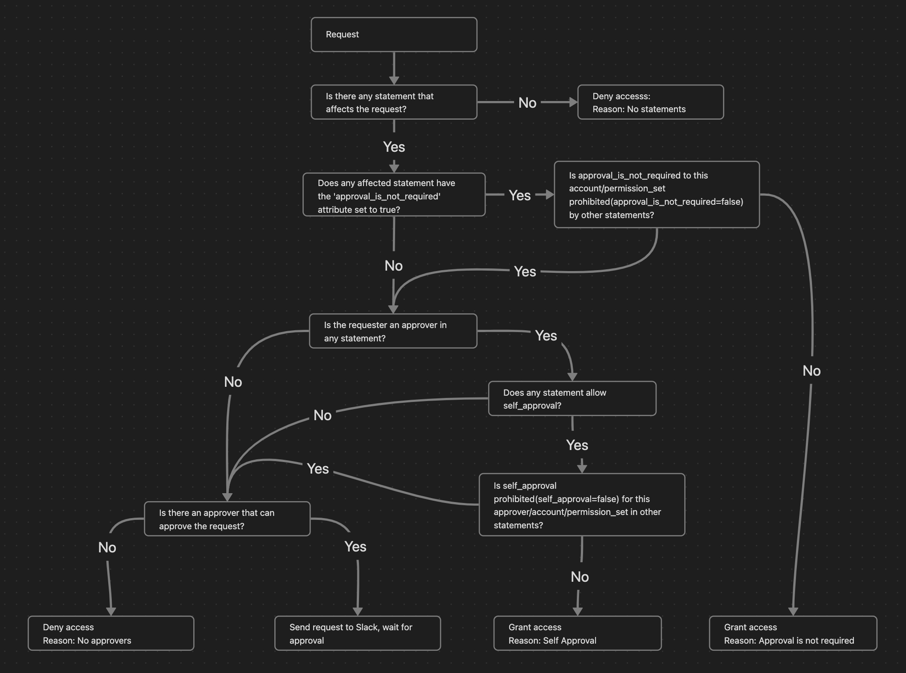

# Configuration

This document covers the configuration structure and rules for SSO Elevator.

## Configuration Structure

The configuration is a list of dictionaries, where each dictionary represents a single configuration rule.

Each configuration rule specifies which resource(s) the rule applies to, which permission set(s) are being requested, who the approvers are, and any additional options for approving the request.

The fields in the configuration dictionary are:

- **ResourceType**: This field specifies the type of resource being requested, such as "Account." As of now, the only supported value is "Account."
- **Resource**: This field defines the specific resource(s) being requested. It accepts either a single string or a list of strings. Setting this field to "*" allows the rule to match all resources associated with the specified `ResourceType`.
- **PermissionSet**: Here, you indicate the permission set(s) being requested. This can be either a single string or a list of strings. You can specify permission sets by **name** (e.g., `"AdministratorAccess"`) or by **ARN** (e.g., `"arn:aws:sso:::permissionSet/ssoins-1234567890abcdef/ps-1234567890abcdef"`). Using ARNs is recommended for Terraform users as it reduces API calls and allows direct reference to `aws_ssoadmin_permission_set.*.arn`. If set to "*", the rule matches all permission sets available for the defined `Resource` and `ResourceType`.
- **Approvers**: This field lists the potential approvers for the request. It accepts either a single string or a list of strings representing different approvers.
- **AllowSelfApproval**: This field can be a boolean, indicating whether the requester, if present in the `Approvers` list, is permitted to approve their own request. It defaults to `None`.
- **ApprovalIsNotRequired**: This field can also be a boolean, signifying whether the approval can be granted automatically, bypassing the approvers entirely. The default value is `None`.
- **RequiredGroupMembership**: This field restricts the rule to only users who are members of at least one of the specified SSO groups. Accepts a single group ID or a list of group IDs. If empty or omitted, the rule applies to all users.

## Explicit Deny

In the system, an explicit denial in any statement overrides any approvals. For instance, if one statement designates an individual as an approver for all accounts, but another statement specifies that the same individual is not allowed to self-approve or to bypass the approval process for a particular account and permission set (by setting "allow_self_approval" and "approval_is_not_required" to `False`), then that individual will not be able to approve requests for that specific account, thereby enforcing a stricter control.

## Automatic Approval

Requests will be approved automatically if either of the following conditions are met:

- AllowSelfApproval is set to true and the requester is in the Approvers list.
- ApprovalIsNotRequired is set to true.

## Aggregation of Rules

The approval decision and final list of reviewers will be calculated dynamically based on the aggregate of all rules. If you have a rule that specifies that someone is an approver for all accounts, then that person will be automatically added to all requests, even if there are more detailed rules for specific accounts or permission sets.

## Single Approver

If there is only one approver and AllowSelfApproval is not set to true, nobody will be able to approve the request.

## Request Processing Diagram



## Configuration Examples

### Dev/Stage Environment (Self-Service)

Allow developers to self-serve permissions in non-production accounts:

```hcl
{
  "ResourceType" : "Account",
  "Resource" : ["dev_account_id", "stage_account_id"],
  "PermissionSet" : "*",
  "Approvers" : ["bob@corp.com", "alice@corp.com"],
  "AllowSelfApproval" : true,
}
```

### Finance Team (Billing Access)

Allow self-approval for specific permission sets:

```hcl
{
  "ResourceType" : "Account",
  "Resource" : "account_id",
  "PermissionSet" : "Billing",
  "Approvers" : "finances@corp.com",
  "AllowSelfApproval" : true,
}
```

### Admin Access (All Accounts)

For CTOs or similar roles who need broad access:

```hcl
{
  "ResourceType" : "Account",
  "Resource" : "*",
  "PermissionSet" : "*",
  "Approvers" : "cto@corp.com",
  "AllowSelfApproval" : true,
}
```

> **Warning**: Be careful with `Resource: "*"` as it will cause revocation of all non-module-created user-level permission set assignments in all accounts. Add this rule later when you are done with single account testing.

### Production Read-Only

Allow developers to check production when needed:

```hcl
{
  "ResourceType" : "Account",
  "Resource" : ["prod_account_id", "prod_account_id2"],
  "PermissionSet" : "ReadOnly",
  "AllowSelfApproval" : true,
}
```

### Production Admin (Strict Approval)

Require explicit approval for production admin access:

```hcl
{
  "ResourceType" : "Account",
  "Resource" : ["prod_account_id", "prod_account_id2"],
  "PermissionSet" : "AdministratorAccess",
  "Approvers" : ["manager@corp.com", "ciso@corp.com"],
  "ApprovalIsNotRequired" : false,
  "AllowSelfApproval" : false,
}
```

### Using Permission Set ARNs (Recommended)

Using ARNs is more efficient as it avoids list_permission_sets API calls:

```hcl
{
  "ResourceType" : "Account",
  "Resource" : "account_id",
  "PermissionSet" : aws_ssoadmin_permission_set.developer.arn,
  "Approvers" : ["tech-lead@corp.com"],
  "AllowSelfApproval" : true,
}
```

### Restricting Access by SSO Group Membership

Only allow users who are members of specific SSO groups to request access:

```hcl
{
  "ResourceType" : "Account",
  "Resource" : ["prod_account_id"],
  "PermissionSet" : "AdministratorAccess",
  "Approvers" : ["oncall@corp.com"],
  "AllowSelfApproval" : true,
  "RequiredGroupMembership" : ["11111111-2222-3333-4444-555555555555"],  # SRE team group ID
}
```

Users not in the specified group(s) won't see this permission set as an option when requesting access. The user must be a member of at least one of the listed groups.
