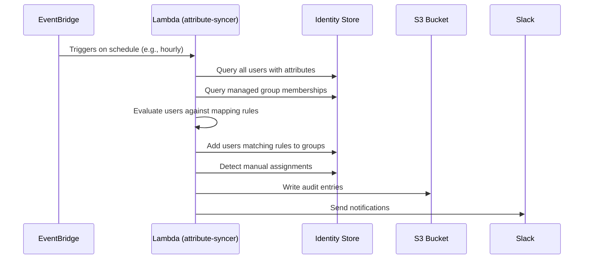

# Group Access

This document covers SSO Elevator's group-based access features.

## Group Assignments Mode

Starting from version 2.0, Terraform AWS SSO Elevator supports group access. SSO elevator can add users to groups using the `/group-access` command, which presents a Slack form where the user can select a group they want access to, specify a reason, and define the duration for which access is required.

The basic logic for access, configuration, and Slack integration remains the same as before.

### Configuration

To enable the Group Assignments Mode, provide the module with the `group_config` Terraform variable:

```hcl
group_config = [
    {
      "Resource" : ["99999999-8888-7777-6666-555555555555"], #ManagementAccountAdmins
      "Approvers" : [
        "email@gmail.com"
      ]
      "ApprovalIsNotRequired": true
    },
    {
      "Resource" : ["11111111-2222-3333-4444-555555555555"], #prod read only
      "Approvers" : [
        "email@gmail.com"
      ]
      "AllowSelfApproval" : true,
    },
    {
      "Resource" : ["44445555-3333-2222-1111-555557777777"], #ProdAdminAccess
      "Approvers" : [
        "email@gmail.com"
      ]
    },
]
```

### Key Differences from Account Configuration

- **ResourceType** is not required for group access configurations.
- In the **Resource** field, you must provide group IDs instead of account IDs.

The Elevator will only work with groups specified in the configuration.

### Slack App Manifest Update

If you were using Terraform AWS SSO Elevator before version 2.0.0, you need to update your Slack app manifest by adding this shortcut:

```json
{
    "name": "group-access",
    "type": "global",
    "callback_id": "request_for_group_membership",
    "description": "Request access to SSO Group"
}
```

To disable this functionality, simply remove the shortcut from the manifest.

---

## Attribute-Based Group Sync

Starting from version 3.0, SSO Elevator introduces automatic user-to-group synchronization based on IAM Identity Center user attributes. This feature allows you to automatically add users to groups based on their organizational attributes (e.g., department, job title, cost center) without manual intervention.

### How It Works



The attribute syncer Lambda runs on a configurable schedule and:

1. Reads attribute mapping rules from configuration
2. Queries all users and their attributes from the Identity Store
3. Evaluates users against mapping rules (exact string matching with AND logic)
4. Adds users to groups when they match rules
5. Detects manually-added users who don't match any rules
6. Optionally removes manual assignments based on policy
7. Logs all operations to the audit bucket
8. Sends Slack notifications for important events

### Configuration

To enable attribute-based group sync, add the following to your Terraform configuration:

```hcl
module "aws_sso_elevator" {
  # ... existing configuration ...

  # Enable the feature
  attribute_sync_enabled = true

  # List of groups to manage (by name)
  attribute_sync_managed_groups = [
    "Engineering",
    "Finance",
    "DevOps",
  ]

  # Attribute mapping rules
  attribute_sync_rules = [
    {
      group_name = "Engineering"
      attributes = {
        department   = "Engineering"
        employeeType = "FullTime"
      }
    },
    {
      group_name = "Finance"
      attributes = {
        department = "Finance"
      }
    },
    {
      group_name = "DevOps"
      attributes = {
        department = "Engineering"
        jobTitle   = "DevOps Engineer"
      }
    },
  ]

  # Policy for handling manual assignments: "warn" or "remove"
  attribute_sync_manual_assignment_policy = "warn"

  # How often to run the sync
  attribute_sync_schedule = "rate(1 hour)"
}
```

### Configuration Options

| Variable | Description | Default |
|----------|-------------|---------|
| `attribute_sync_enabled` | Enable/disable the feature | `false` |
| `attribute_sync_managed_groups` | List of group names to manage | `[]` |
| `attribute_sync_rules` | Attribute mapping rules | `[]` |
| `attribute_sync_manual_assignment_policy` | Policy for manual assignments: `warn` or `remove` | `"warn"` |
| `attribute_sync_schedule` | Schedule expression (e.g., `rate(1 hour)`) | `"rate(1 hour)"` |
| `attribute_sync_lambda_memory` | Lambda memory in MB | `512` |
| `attribute_sync_lambda_timeout` | Lambda timeout in seconds | `300` |

### Attribute Mapping Rules

Each rule specifies:

- **group_name**: The name of the group to add users to (must be in `attribute_sync_managed_groups`)
- **attributes**: A map of attribute conditions that must ALL match (AND logic)

Supported attributes include any SCIM attributes in your Identity Store:

- `department`
- `employeeType`
- `costCenter`
- `jobTitle`
- Custom attributes

### Manual Assignment Policy

When the syncer detects users in managed groups who don't match any rules:

- **warn** (default): Logs a warning and sends a Slack notification, but does not remove the user
- **remove**: Automatically removes the user from the group and sends a notification

### Audit Logging

All sync operations are logged to the same S3 audit bucket used by SSO Elevator:

- `sync_add`: User added to group based on attribute match
- `sync_remove`: User removed from group (no longer matches rules)
- `manual_detected`: Manual assignment detected (user doesn't match rules)

### Slack Notifications

The syncer sends notifications for:

- Users added to groups
- Manual assignments detected
- Manual assignments removed (when policy is `remove`)
- Sync errors

---

## Migration Guide for Existing Deployments

If you're upgrading from a previous version of SSO Elevator:

### Phase 1: Deploy with feature disabled (default)

```hcl
# No changes needed - feature is disabled by default
module "aws_sso_elevator" {
  source  = "github.com/PostHog/terraform-aws-sso-elevator"
  # ... existing configuration ...
}
```

### Phase 2: Configure and enable

```hcl
module "aws_sso_elevator" {
  source  = "github.com/PostHog/terraform-aws-sso-elevator"
  # ... existing configuration ...

  attribute_sync_enabled = true
  attribute_sync_managed_groups = ["Engineering", "Finance"]
  attribute_sync_rules = [
    {
      group_name = "Engineering"
      attributes = { department = "Engineering" }
    },
    {
      group_name = "Finance"
      attributes = { department = "Finance" }
    },
  ]
  # Start with "warn" to review manual assignments
  attribute_sync_manual_assignment_policy = "warn"
}
```

### Phase 3: Monitor and adjust

- Review Slack notifications for manual assignments
- Adjust mapping rules as needed
- Once confident, change policy from `warn` to `remove` if desired

---

## Rollback Strategy

If issues arise after enabling attribute sync:

### Immediate rollback

Set `attribute_sync_enabled = false` and apply:

```hcl
attribute_sync_enabled = false
```

This will:

- Stop scheduled syncs immediately
- Preserve existing group memberships (no users removed)
- Keep all audit logs in S3

### Complete removal

Remove all attribute sync configuration:

- The Lambda function and EventBridge rule will be deleted
- Existing group memberships remain unchanged
- Audit logs remain in S3 for compliance

---

## Important Considerations

1. **Managed Groups Only**: The syncer only operates on groups explicitly listed in `attribute_sync_managed_groups`. All other groups are completely ignored.

2. **Group Names**: Configuration uses human-readable group names. The Lambda resolves names to IDs at runtime.

3. **Attribute Matching**: Uses exact string matching. Attribute values must match exactly (case-sensitive).

4. **AND Logic**: When multiple attributes are specified in a rule, ALL must match for the user to be added.

5. **Caching**: The syncer uses the same caching mechanism as SSO Elevator to minimize API calls.

6. **Error Handling**: If an error occurs processing one group or user, the syncer continues with others and reports errors in the summary notification.

7. **No Overlap with group_config**: Groups in `attribute_sync_managed_groups` must NOT also appear in `group_config`. The attribute syncer adds users permanently based on attributes, while `group_config` is for JIT (just-in-time) access with scheduled revocation. If the same group is in both, the revoker will see attribute-synced users as "inconsistent assignments" and warn about them. Terraform will fail with a validation error if overlap is detected.
