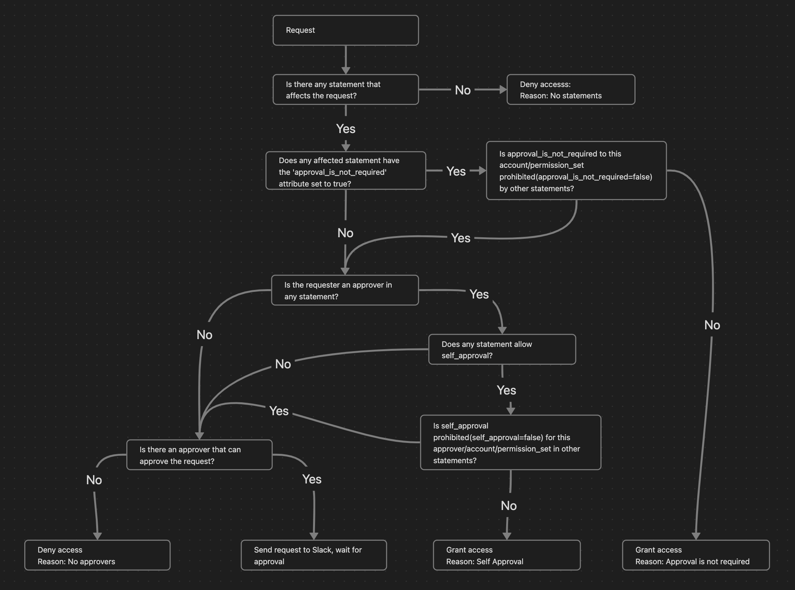

# Configuration

Approval rules come from two inputs: `config` for account and permission-set requests, and `group_config` for group-membership requests. Each is a list of statements. The module writes both to `config/approval-config.json` in the config bucket, and the Lambdas load them from there.

## Account Statements (`config`)

Each statement says what can be requested, who approves it, and optionally who may request it.

- **ResourceType**: required. Use `"Account"`; it is the only type the Elevator acts on.
- **Resource**: an account ID or a list of them. `"*"` matches every account.
- **PermissionSet**: a permission-set name or a list of them. `"*"` matches every permission set.
- **Approvers**: an email or a list of emails.
- **AllowSelfApproval**: `true` lets a requester who is in this statement's `Approvers` get access without anyone approving. `false` is an explicit deny (see below). Unset by default.
- **ApprovalIsNotRequired**: `true` grants access without approval. `false` is an explicit deny. Unset by default.
- **AllowedGroups**: optional. An SSO group ID or a list of them. See [Restricting Who Can Request Access](#restricting-who-can-request-access).
- **AllowedUsers**: optional. An email or a list of emails. See [Restricting Who Can Request Access](#restricting-who-can-request-access).

A field that takes a list also accepts a single string.

```hcl
config = [
  {
    "ResourceType" : "Account",
    "Resource" : "*",
    "PermissionSet" : "ReadOnlyAccess",
    "Approvers" : ["lead@example.com"],
    "AllowSelfApproval" : true,
  },
  {
    "ResourceType" : "Account",
    "Resource" : ["111111111111", "222222222222"],
    "PermissionSet" : ["AdministratorAccess", "PowerUserAccess"],
    "Approvers" : ["cto@example.com", "lead@example.com"],
  },
  {
    "ResourceType" : "Account",
    "Resource" : "333333333333",
    "PermissionSet" : "ReadOnlyAccess",
    "ApprovalIsNotRequired" : true,
  },
]
```

## Group Statements (`group_config`)

Group requests add the requester to an IAM Identity Center group for a limited time. They are Slack-only (the `group-access` global shortcut, see [Slack](slack.md)); the CLI requests account access only.

A group statement takes the same fields as an account statement, with two differences: there is no `ResourceType` or `PermissionSet`, and `Resource` holds group IDs, not account IDs. The Elevator only offers groups listed in some statement's `Resource`.

```hcl
group_config = [
  {
    "Resource" : ["99999999-8888-7777-6666-555555555555"], # ManagementAccountAdmins
    "Approvers" : ["cto@example.com"],
    "ApprovalIsNotRequired" : true,
  },
  {
    "Resource" : ["11111111-2222-3333-4444-555555555555"], # ProdReadOnly
    "Approvers" : ["lead@example.com"],
    "AllowSelfApproval" : true,
  },
  {
    "Resource" : ["44445555-3333-2222-1111-555557777777"], # ProdAdminAccess
    "Approvers" : ["cto@example.com"],
  },
]
```

Do not put a group managed by [attribute sync](attribute-sync.md) in `group_config`.

## How a Request Is Decided

For a request, the Elevator collects every statement that matches it (the account and permission set, or the group) and that the requester may use. Then:

1. **Explicit deny.** Two separate controls. If any of those statements sets `ApprovalIsNotRequired = false`, no statement's `ApprovalIsNotRequired = true` takes effect; self-approval still can. If any statement sets `AllowSelfApproval = false` and lists the requester in its `Approvers`, no statement's `AllowSelfApproval = true` takes effect for that requester; `ApprovalIsNotRequired = true` still can.
2. **Automatic approval.** Otherwise access is granted at once if a statement sets `ApprovalIsNotRequired = true`, or sets `AllowSelfApproval = true` and lists the requester in its `Approvers`.
3. **Approvers.** Otherwise the approvers are the union of `Approvers` across all those statements, minus the requester. A statement covering all accounts adds its approvers to every request, even where a narrower statement exists.
4. **Nobody can approve.** If that set is empty, the request fails with "Nobody can approve this request." This is what happens when the requester is the only approver and self-approval is not allowed. If no statement matches, the request fails with "No statement in the configuration covers this request."

Explicit deny only governs the automatic decision. When someone clicks Approve, the click counts if the clicker is in the `Approvers` of any matching statement. For a click on their own request, that statement must also set `AllowSelfApproval = true`. So a requester denied self-approval by one statement can still approve their own request by clicking, if another matching statement lists them with `AllowSelfApproval = true`. Do not give one person both.

The diagram below shows steps 1-4. It predates `AllowedGroups`/`AllowedUsers`: statements the requester may not use are dropped before its first step.



## Restricting Who Can Request Access

Without `AllowedGroups` or `AllowedUsers`, a statement says what can be requested and who approves it, but anyone the Elevator can resolve in IAM Identity Center may request it. The two fields restrict the requester, in both `config` and `group_config`:

- If both are empty or omitted, the statement is unrestricted.
- If either is set, the requester must be a member of a group in `AllowedGroups` **or** be listed in `AllowedUsers`. Either is enough.
- `AllowedGroups` entries are group IDs, the same format as `Resource` in `group_config`.
- `AllowedUsers` entries match the requester's email case-insensitively, including the variants built from `secondary_fallback_email_domains`.
- The restriction covers the whole statement: a requester who may not use a statement gets nothing from its `ApprovalIsNotRequired` or `AllowSelfApproval`, and its approvers do not count.
- It is checked when the request is made and again when it is approved.
- If the requester cannot be resolved to an Identity Center user, or their group memberships cannot be read, the request stops with an error and nothing is granted.
- If statements match the request but the requester may use none of them, the request fails with "not allowed to request this access".
- The Slack request forms list only the groups, accounts and permission sets the requester may request; if there are none, the form shows a "not allowed" message instead. Accounts and permission sets are filtered separately, so a combination the requester may not request can still be selected; it is denied on submit.

Example: anyone can request `ReadOnlyAccess`, but only the infra group, or the on-call user, can request `AdministratorAccess` or the `ProdAdmins` group:

```hcl
config = [
  {
    "ResourceType" : "Account",
    "Resource" : "*",
    "PermissionSet" : "ReadOnlyAccess",
    "Approvers" : ["lead@example.com"],
  },
  {
    "ResourceType" : "Account",
    "Resource" : "*",
    "PermissionSet" : "AdministratorAccess",
    "Approvers" : ["cto@example.com"],
    "AllowedGroups" : ["99999999-8888-7777-6666-555555555555"], # infra team
    "AllowedUsers" : ["oncall@example.com"],
  },
]

group_config = [
  {
    "Resource" : ["11111111-2222-3333-4444-555555555555"], # ProdAdmins
    "Approvers" : ["cto@example.com"],
    "AllowedGroups" : ["99999999-8888-7777-6666-555555555555"], # infra team
    "AllowedUsers" : ["oncall@example.com"],
  },
]
```

## How Requesters Are Matched to IAM Identity Center Users

A Slack request is matched by the requester's Slack email. A CLI request is matched by the identity the CLI proves, never by email fallback.

If two or more Identity Store users share an email case-insensitively, every request that resolves to that email fails with an "email collision" error. The error stays until someone removes the duplicate in the Identity Store.

### Secondary Domain Fallback

**Strongly discouraged: it can grant access to the wrong person.**

When a Slack email's domain differs from the one in IAM Identity Center, `secondary_fallback_email_domains` makes the Elevator retry the lookup with the Slack local part and each listed domain, in order. For example, with Slack `john.doe@old.domain` and Identity Center `john.doe@new.domain`, set `secondary_fallback_email_domains = ["@new.domain"]`. Each entry starts with `@`.

- The Slack email is always tried first.
- It applies to Slack requesters only. Approvers must have the same email in Slack as in the configuration.
- The request message in Slack shows a :warning: line when a requester was matched through a fallback domain.
- If different people share a local part across domains, a request can resolve to the wrong user. Use it only when you cannot align the domains, and remove the entries once you have.

## Direct Messages to Requesters

Some teams keep only approvers in the Elevator channel, so requesters never see what happened to their request. With `send_dm_if_user_not_in_channel = true` (the default), the Elevator sends the request status and result as a direct message to a requester who is not in the channel.

This needs the Slack scopes `channels:read`, `groups:read` and `im:write` (in the [manifest](slack.md#create-the-slack-app)). If the membership check fails, the Elevator treats the requester as outside the channel and sends the DM anyway; a failed DM is logged and does not affect the request. Set the variable to `false` if your Slack app lacks those scopes, to stop the failing calls.
